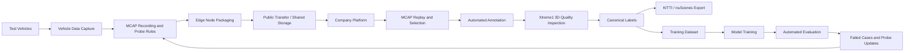

# Autonomous Data Loop

[简体中文](README.zh-CN.md)

An autonomous driving data loop system design and engineering portfolio, covering vehicle-cloud data upload, MCAP playback, automated annotation, 3D quality inspection, dataset export, training, evaluation, and feedback-driven data collection.

> This repository is a sanitized technical portfolio. It focuses on architecture, engineering decisions, staged delivery, demo artifacts, and reusable examples. It does not include proprietary source code, internal endpoints, credentials, customer data, or confidential deployment details.

## What This Project Shows

This project demonstrates how an autonomous driving data loop can evolve from basic data upload to a complete engineering loop:

1. Collect and package vehicle-side data.
2. Upload selected data from edge or field collection nodes to the company-side platform.
3. Review and replay MCAP assets on the platform.
4. Run automated annotation and 3D quality inspection.
5. Export labels in multiple dataset formats.
6. Build training datasets and model versions.
7. Run automated evaluation and feed failed cases back into the next data collection cycle.

## System Roadmap

| Phase | Name | Scope | Status |
|---|---|---|---|
| Phase 1 | Vehicle-cloud data upload | Metadata, probe rules, MCAP packaging, compression, upload, cloud ingestion, playback verification | Completed |
| Phase 2 | Automated annotation and QC | MCAP asset management, automated annotation, Xtreme1 3D quality inspection, label versioning, KITTI/nuScenes export | Completed |
| Phase 3 | Dataset management | Canonical labels, dataset versioning, sample selection, dataset traceability | Completed |
| Phase 4 | Model training | Training task orchestration, model registry, metric tracking, model-to-data traceability | Planned |
| Phase 5 | Automated test and evaluation | MCAP replay, SOC/Xavier execution, perception output comparison, evaluation reports | Planned |
| Phase 6 | Feedback-driven collection | Failed-case analysis, probe-rule updates, targeted recollection, closed-loop iteration | Planned |

## High-Level Architecture



## Repository Structure

```text
autonomous-data-loop/
├─ docs/                 # Bilingual technical documentation
├─ diagrams/             # Architecture diagrams and flow diagrams
├─ demos/                # Videos, screenshots, and interactive demo pages
├─ examples/             # Sanitized metadata, manifest, API, and label examples
├─ src-demo/             # Small public demo code, not production code
├─ assets/               # Shared images and media assets
├─ README.md             # English entry point
└─ README.zh-CN.md       # Chinese entry point
```

## Documentation

All documentation is maintained in both English and Chinese:

- English files use `README.md` or `*.md`.
- Chinese files use `README.zh-CN.md` or `*.zh-CN.md`.

Start here:

- [Overview](docs/00-overview/README.md)
- [Phase 1: Vehicle-cloud Data Upload](docs/01-phase1-vehicle-cloud-upload/README.md)
- [Phase 2: Automated Annotation and QC](docs/02-phase2-auto-labeling-qc/README.md)
- [Architecture](docs/architecture/README.md)
- [AI Agent Workflow](docs/ai-agent-workflow/README.md)
- [Phase 3: Dataset Management](docs/03-phase3-dataset-training/README.md)
- [Phase 4: Model Training](docs/04-phase4-model-training/README.md)
- [Phase 5: Automated Test and Evaluation](docs/05-phase5-auto-test-evaluation/README.md)
- [Roadmap](docs/roadmap/README.md)

## Public Code Strategy

The real production code is not published here. Instead, this repository will include sanitized and reusable demo code:

- MCAP metadata indexing examples.
- Probe rule examples.
- Package manifest examples.
- Label schema examples.
- Canonical label to KITTI / nuScenes conversion demos.
- Task state machine demos.
- Mock API definitions for platform workflows.

This keeps the repository useful for technical review while protecting company assets and deployment details.

## AI-Assisted Engineering

This project also records how AI agents can assist real engineering work:

- Turning raw project materials into structured design documents.
- Iterating architecture after review feedback.
- Generating presentations, demos, and technical documentation.
- Breaking down implementation plans and schedule estimates.
- Preparing future development workflows for code generation, compilation, debugging, and release support.

See [AI Agent Workflow](docs/ai-agent-workflow/README.md).

## Author Role

In the original project, I worked as the project owner / technical lead for the data loop effort, coordinating vehicle-side software, platform backend, platform frontend, algorithm engineering, design reviews, integration testing, and delivery planning.
