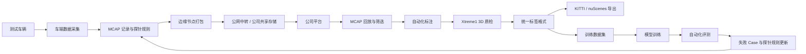

# Autonomous Data Loop / 自动驾驶数据闭环

[English](README.md)

这是一个面向自动驾驶场景的数据闭环系统设计与工程实践作品集，覆盖车端数据采集、车云回传、MCAP 回放、自动化标注、3D 质检、多格式标签导出、训练、评测和问题回灌。

> 本仓库是脱敏后的技术作品集，重点展示系统架构、阶段设计、工程决策、演示材料和可复用示例。仓库不包含公司真实源码、内部接口、账号凭据、客户数据或保密部署信息。

## 项目展示什么

这个项目展示了一套自动驾驶数据闭环系统如何从基础数据上云逐步演进为完整工程闭环：

1. 车端采集并打包数据。
2. 外场/边缘节点筛选数据并回传到公司侧平台。
3. 平台管理、筛选并回放 MCAP 数据。
4. 执行自动化标注和 3D 质检。
5. 导出多种训练数据格式。
6. 沉淀训练数据集和模型版本。
7. 自动化评测并将失败 case 回灌到下一轮数据采集。

## 阶段路线

| 阶段 | 名称 | 范围 | 状态 |
|---|---|---|---|
| Phase 1 | 车云数据回传 | 元数据、探针规则、MCAP 打包、压缩、上传、云端接收、回放验证 | 已完成 |
| Phase 2 | 自动化标注与质检 | MCAP 资产管理、自动化标注、Xtreme1 3D 质检、标签版本、KITTI/nuScenes 导出 | 已完成 |
| Phase 3 | 数据集管理 | 统一标签、数据集版本、样本筛选、数据集追溯 | 已完成 |
| Phase 4 | 模型训练 | 训练任务、模型版本、指标跟踪、模型到数据的追溯 | 规划中 |
| Phase 5 | 自动化测试与评测 | MCAP 回放、SOC/Xavier 执行、感知输出对比、测试报告 | 规划中 |
| Phase 6 | 问题回灌与主动采集 | 失败 case 分析、探针规则更新、定向采集、闭环迭代 | 规划中 |

## 总体架构



## 仓库结构

```text
autonomous-data-loop/
├─ docs/                 # 中英文双语技术文档
├─ diagrams/             # 架构图、流程图、数据流图
├─ demos/                # 视频、截图、交互演示页
├─ examples/             # 脱敏后的元数据、manifest、API、标签样例
├─ src-demo/             # 可公开的小型示例代码，不是生产代码
├─ assets/               # README 和文档共用素材
├─ README.md             # 英文入口
└─ README.zh-CN.md       # 中文入口
```

## 文档入口

所有文档都维护中英文双版：

- 英文文档使用 `README.md` 或 `*.md`。
- 中文文档使用 `README.zh-CN.md` 或 `*.zh-CN.md`。

建议从这里开始：

- [项目总览](docs/00-overview/README.zh-CN.md)
- [阶段一：车云数据回传](docs/01-phase1-vehicle-cloud-upload/README.zh-CN.md)
- [阶段二：自动化标注与质检](docs/02-phase2-auto-labeling-qc/README.zh-CN.md)
- [阶段三：数据集管理](docs/03-phase3-dataset-training/README.zh-CN.md)
- [阶段四：模型训练](docs/04-phase4-model-training/README.zh-CN.md)
- [阶段五：自动化测试与评测](docs/05-phase5-auto-test-evaluation/README.zh-CN.md)
- [总体架构](docs/architecture/README.zh-CN.md)
- [AI Agent 协作方式](docs/ai-agent-workflow/README.zh-CN.md)
- [路线图](docs/roadmap/README.zh-CN.md)

## 代码公开策略

真实生产代码不放在本仓库中。本仓库会放脱敏后、可复用的示例代码：

- MCAP 元数据索引示例。
- 探针规则示例。
- 数据包 manifest 示例。
- 标签 schema 示例。
- 统一标签格式到 KITTI / nuScenes 的转换 demo。
- 任务状态机 demo。
- 平台流程的 mock API 定义。

这样既能展示技术深度，也能保护公司资产和部署细节。

## AI 辅助工程实践

本项目也记录了 AI Agent 如何参与真实工程项目：

- 将原始项目材料整理成结构化设计文档。
- 根据评审意见快速重构方案。
- 生成汇报 PPT、演示视频和技术文档。
- 拆解开发计划和周期预估。
- 为后续代码生成、编译、调试和发版准备协作流程。

详见：[AI Agent 协作方式](docs/ai-agent-workflow/README.zh-CN.md)。

## 我的角色

在原始项目中，我作为数据闭环项目负责人 / 技术负责人，负责统筹车端软件、平台后端、平台前端、算法工程、设计评审、联调测试和交付规划。
