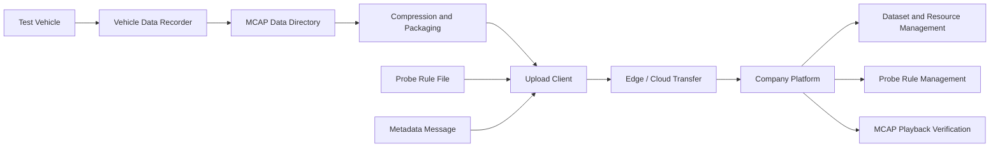

# Phase 1: Vehicle-Cloud Data Upload

[简体中文](README.zh-CN.md)

Phase 1 establishes the first reliable data path in the autonomous driving data loop: vehicle-side data is captured, packaged as MCAP-related assets, compressed, uploaded through the edge/cloud path, and verified on the company-side platform.

This phase is intentionally focused on the foundation of the loop. It does not try to solve automated annotation, training, or evaluation yet. Its job is to prove that data can move from vehicles to the platform with enough metadata, traceability, and playback evidence to support the next phases.

## Goals

- Capture and package vehicle-side data with traceable metadata.
- Maintain probe rules that control which data should be collected and uploaded.
- Compress and upload MCAP packages from the vehicle or edge side.
- Let the platform manage vehicles, events, probe rules, datasets, and uploaded resources.
- Verify the end-to-end path through integration testing and playback evidence.

## Scope

| Area | Phase 1 capability |
|---|---|
| Vehicle side | Metadata generation, probe rule loading, MCAP package discovery, compression, upload trigger |
| Edge/cloud communication | Persistent connection, heartbeat, resource request, upload status |
| Platform side | Vehicle/event visibility, probe maintenance, dataset/resource management, playback entry |
| Evidence | Upload logs, compressed package evidence, platform resource list, MCAP playback screenshot |

## Architecture

## Key Documents

- [Design Summary](design-summary.md)
- [Integration Test Summary](integration-test.md)
- [Results and Evidence](results.md)
- [Publication and Sanitization Checklist](publication-sanitization.md)

## Status

Completed.

Phase 1 provides the operational baseline for Phase 2 automated annotation and quality inspection.

