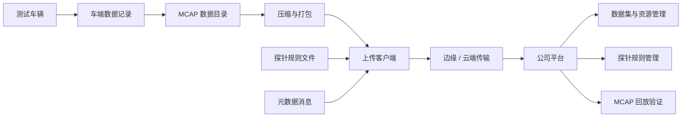

# 阶段一：车云数据回传

[English](README.md)

阶段一建立自动驾驶数据闭环中的第一条可靠链路：车端数据被采集、组织为 MCAP 相关资产、压缩打包、通过边缘/云端链路上传，并在公司侧平台完成管理与回放验证。

这一阶段的定位是“基础闭环”，不解决自动化标注、模型训练和自动化评测。它要证明的是：数据可以从车辆侧稳定进入平台，并且具备元数据、可追溯性和回放证据，能够支撑后续阶段继续建设。

## 目标

- 车端生成带可追溯信息的数据包和元数据。
- 维护探针规则，用于控制哪些数据需要采集和上传。
- 车端或边缘侧对 MCAP 数据进行压缩和上传。
- 平台侧支持车辆、事件、探针、数据集和上传资源管理。
- 通过联调测试和回放证据验证端到端链路。

## 范围

| 领域 | 阶段一能力 |
|---|---|
| 车端侧 | 元数据生成、探针规则加载、MCAP 包发现、压缩、上传触发 |
| 边缘/云端通信 | 长连接、心跳、资源请求、上传状态 |
| 平台侧 | 车辆/事件可见、探针维护、数据集/资源管理、回放入口 |
| 成果证据 | 上传日志、压缩包证据、平台资源列表、MCAP 回放截图 |

## 架构

## 关键文档

- [设计摘要](design-summary.zh-CN.md)
- [联调测试总结](integration-test.zh-CN.md)
- [成果与证据](results.zh-CN.md)
- [公开与脱敏清单](publication-sanitization.zh-CN.md)

## 状态

已完成。

阶段一为阶段二的自动化标注与质检提供了可运行的数据基础。

