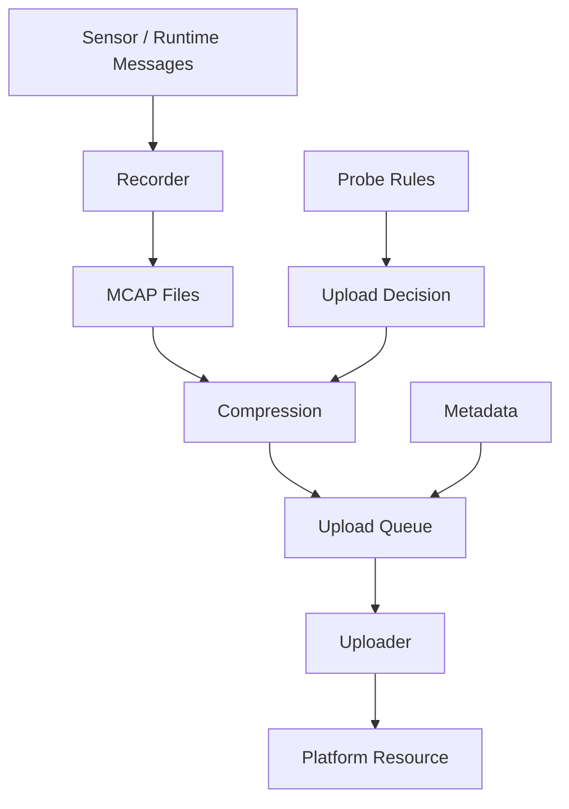
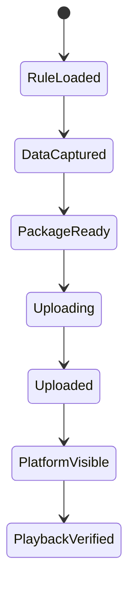

# Design Summary

[简体中文](design-summary.zh-CN.md)

## Design Intent

Phase 1 builds the foundational vehicle-cloud data path. The design keeps the vehicle-side logic lightweight while making the uploaded data understandable and manageable on the platform side.

The core idea is simple: vehicle-side modules capture data and metadata, probe rules decide what should be uploaded, upload clients package and transfer MCAP assets, and the platform records the result as searchable resources.

## Core Modules

| Module | Responsibility |
|---|---|
| Metadata generator | Produces event, time range, file, size, and checksum information for uploaded packages |
| Probe rule manager | Loads and updates probe rules that control data collection and upload behavior |
| MCAP package uploader | Discovers, compresses, shards, and uploads MCAP-related packages |
| Connection manager | Maintains cloud/platform connection and heartbeat |
| Platform resource service | Stores uploaded package records and exposes dataset/resource views |
| Playback entry | Allows users to verify that uploaded MCAP data can be opened and reviewed |

## Vehicle-Side Runtime View

## Metadata Baseline

Phase 1 metadata is used to answer four questions:

1. What package was uploaded?
2. Which event or probe rule triggered it?
3. What time range does it cover?
4. How can the platform verify package integrity?

The sample evidence used during integration included:

| Field | Sanitized example |
|---|---|
| Package type | MCAP backup archive |
| Duration | About 21 seconds |
| Compressed size | About 325 MB |
| Sharding count | 33 shards |
| Integrity | Checksum recorded |

## State Flow

## Design Boundary

Phase 1 does not include:

- Automated annotation.
- Manual annotation quality inspection.
- Dataset version management.
- Model training.
- Automated evaluation.

Those capabilities are intentionally moved to later phases.

