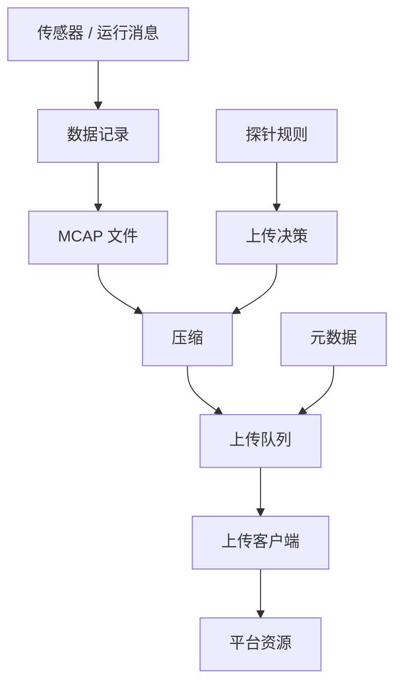
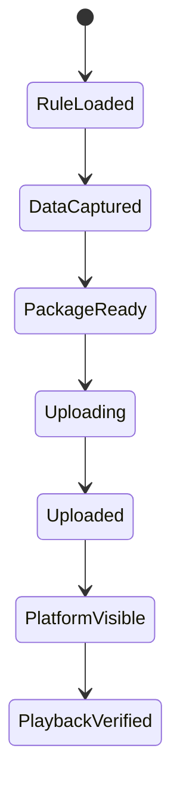

# 设计摘要

[English](design-summary.md)

## 设计意图

阶段一建设的是车云数据闭环的基础链路。设计原则是让车端逻辑尽量轻量，同时让上传到平台的数据具备可理解、可管理和可追溯能力。

核心思路是：车端模块负责采集数据和元数据，探针规则决定哪些数据需要上传，上传客户端对 MCAP 资产进行压缩、分片和传输，平台侧将上传结果沉淀为可检索的数据资源。

## 核心模块

| 模块 | 职责 |
|---|---|
| 元数据生成 | 生成事件、时间范围、文件、大小、校验等上传包信息 |
| 探针规则管理 | 加载和更新探针规则，控制数据采集与上传行为 |
| MCAP 包上传 | 发现、压缩、分片并上传 MCAP 相关数据包 |
| 连接管理 | 维护与云端/平台侧的连接和心跳 |
| 平台资源服务 | 保存上传包记录，并提供数据集和资源视图 |
| 回放入口 | 让用户验证上传后的 MCAP 数据可以被打开和查看 |

## 车端运行视图

## 元数据基线

阶段一的元数据主要回答四个问题：

1. 上传了哪个数据包？
2. 哪个事件或探针规则触发了上传？
3. 数据覆盖了哪个时间范围？
4. 平台如何校验数据包完整性？

联调证据中使用过的脱敏样例包括：

| 字段 | 脱敏样例 |
|---|---|
| 数据包类型 | MCAP 备份归档 |
| 持续时间 | 约 21 秒 |
| 压缩后大小 | 约 325 MB |
| 分片数量 | 33 片 |
| 完整性 | 记录校验值 |

## 状态流转

## 设计边界

阶段一不包含：

- 自动化标注。
- 人工标注质检。
- 数据集版本管理。
- 模型训练。
- 自动化评测。

这些能力被有意放到后续阶段建设。

