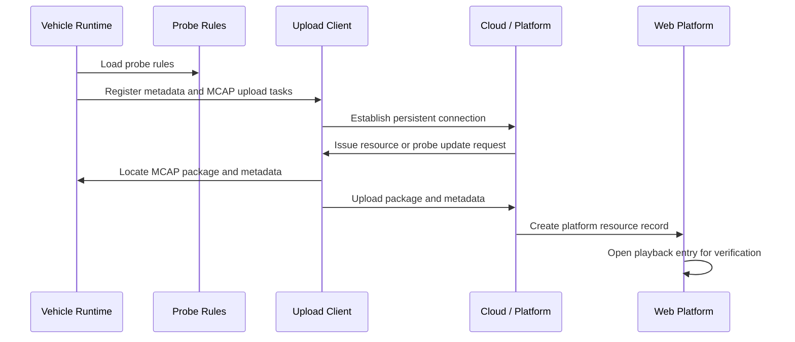

# Integration Test Summary

[简体中文](integration-test.zh-CN.md)

## Objective

The integration test verifies that vehicle-side modules, cloud/platform communication, platform resource management, and playback verification can work as one chain.

## Test Scope

| Layer | Verification item |
|---|---|
| Vehicle side | Runtime modules start, probe file loads, metadata path works, MCAP upload task is registered |
| Communication | Persistent connection starts, heartbeat continues, upload request path is available |
| Platform side | Vehicle/event records are visible, probe rules can be maintained, uploaded resources appear in datasets |
| Playback | Uploaded MCAP package can be opened through a platform playback entry |

## Sanitized Runtime Evidence

The following evidence was extracted from integration logs and generalized for public documentation:

```text
runtime initialized
registered task: connection manager
registered task: metadata message uploader
registered task: metadata file uploader
registered task: MCAP file uploader
registered task: probe file updater
loaded probe rule file successfully
loaded metadata file path successfully
connection initiated to platform endpoint
heartbeat and upload tasks active
```

## End-to-End Sequence



## Test Result

Phase 1 integration reached the expected baseline:

- Vehicle-side upload-related modules started successfully.
- Probe and metadata files were loaded.
- The platform could manage vehicle/event/probe records.
- Uploaded resources could be viewed from the platform dataset.
- A playback screenshot confirmed that uploaded MCAP data could be reviewed from the platform side.

