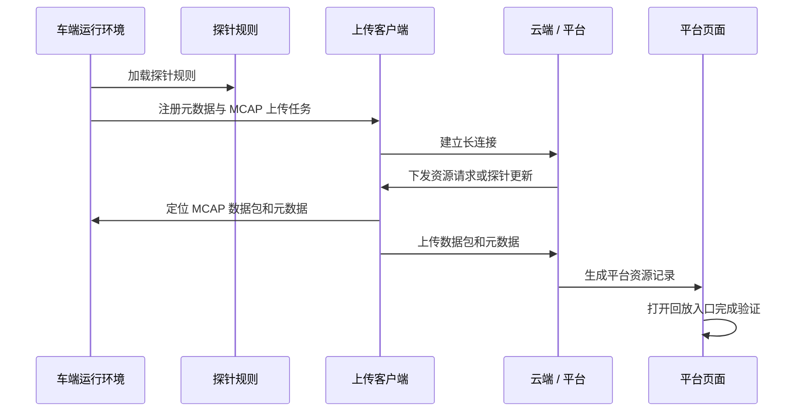

# 联调测试总结

[English](integration-test.md)

## 目标

联调测试用于验证车端模块、云端/平台通信、平台资源管理和回放验证能够组成一条完整链路。

## 测试范围

| 层级 | 验证项 |
|---|---|
| 车端侧 | 运行模块启动、探针文件加载、元数据链路可用、MCAP 上传任务注册 |
| 通信链路 | 长连接启动、心跳持续、上传请求链路可用 |
| 平台侧 | 车辆/事件记录可见、探针规则可维护、上传资源进入数据集 |
| 回放验证 | 上传后的 MCAP 包可以通过平台回放入口打开 |

## 脱敏运行证据

以下证据从联调日志中提炼，并做了公开化表达：

```text
runtime initialized
registered task: connection manager
registered task: metadata message uploader
registered task: metadata file uploader
registered task: MCAP file uploader
registered task: probe file updater
loaded probe rule file successfully
loaded metadata file path successfully
connection initiated to platform endpoint
heartbeat and upload tasks active
```

## 端到端时序



## 测试结果

阶段一联调达到预期基线：

- 车端上传相关模块能够成功启动。
- 探针文件和元数据文件能够加载。
- 平台可以管理车辆、事件和探针记录。
- 上传资源可以在平台数据集中查看。
- 回放截图证明平台侧可以查看上传后的 MCAP 数据。

