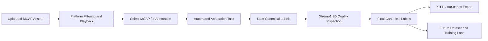

# Phase 2: Automated Annotation and Quality Inspection

[简体中文](README.zh-CN.md)

Phase 2 turns uploaded MCAP assets into usable labels. It connects platform-side MCAP management, automated annotation, Xtreme1-based 3D quality inspection, canonical label versioning, and multi-format export.

The focus is not to build training or automated testing yet. Phase 2 creates the data production line that later phases will rely on.

## Goals

- Manage uploaded MCAP assets on the company-side platform.
- Let users filter and replay MCAP data before annotation.
- Run automated annotation to generate draft labels.
- Use Xtreme1 for 3D quality inspection and manual correction.
- Store labels in a canonical internal format.
- Export final labels to KITTI and nuScenes, with extension points for future formats.

## Scope

| Area | Phase 2 capability |
|---|---|
| MCAP asset management | Metadata indexing, filtering, details, playback entry |
| Automated annotation | Task creation, preprocessing, inference worker, draft label storage |
| Xtreme1 integration | Task creation, data import, quality inspection, result retrieval |
| Label lifecycle | `draft`, `qc`, `final`, and `frozen` versions |
| Export | KITTI and nuScenes adapters, async export tasks, downloadable packages |

## End-to-End Flow

## Key Documents

- [Design Summary](design-summary.md)
- [Workflow](workflow.md)
- [Xtreme1 Integration](xtreme1-integration.md)
- [Label Schema and Export](label-schema-and-export.md)
- [Development Plan](development-plan.md)

## Status

Designed and ready for implementation.

