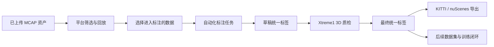

# 阶段二：自动化标注与质检

[English](README.md)

阶段二将已经上传到平台的 MCAP 资产转化为可使用的标签数据。它连接平台侧 MCAP 管理、自动化标注、基于 Xtreme1 的 3D 质检、统一标签版本管理和多格式导出。

这一阶段的重点不是训练或自动化测试，而是先建立后续阶段依赖的数据生产线。

## 目标

- 在公司侧平台管理已上传的 MCAP 资产。
- 让用户在标注前筛选并回放 MCAP 数据。
- 运行自动化标注，生成草稿标签。
- 使用 Xtreme1 进行 3D 质检和人工校准。
- 将标签保存为内部统一格式。
- 支持最终标签导出为 KITTI 和 nuScenes，并为未来格式扩展预留接口。

## 范围

| 领域 | 阶段二能力 |
|---|---|
| MCAP 资产管理 | 元数据索引、筛选、详情、回放入口 |
| 自动化标注 | 任务创建、预处理、推理 Worker、草稿标签入库 |
| Xtreme1 集成 | 任务创建、数据导入、质检、结果回收 |
| 标签生命周期 | `draft`、`qc`、`final`、`frozen` 版本 |
| 导出 | KITTI 和 nuScenes 适配器、异步导出任务、可下载数据包 |

## 端到端流程

## 关键文档

- [设计摘要](design-summary.zh-CN.md)
- [业务流程](workflow.zh-CN.md)
- [Xtreme1 集成](xtreme1-integration.zh-CN.md)
- [标签格式与导出](label-schema-and-export.zh-CN.md)
- [开发计划](development-plan.zh-CN.md)

## 公开示例

- [MCAP 资产元数据示例](../../examples/metadata/mcap-asset-metadata.example.json)
- [标注输入 manifest 示例](../../examples/manifest/phase2-annotation-input-manifest.example.json)
- [统一标签格式示例](../../examples/label-format/canonical-label.example.json)
- [阶段二 mock API](../../examples/api/phase2-api.openapi.yaml)
- [任务状态机 demo](../../src-demo/task-state-machine-demo/README.zh-CN.md)
- [统一标签转换 demo](../../src-demo/label-converter-demo/README.zh-CN.md)

## 状态

已完成。
