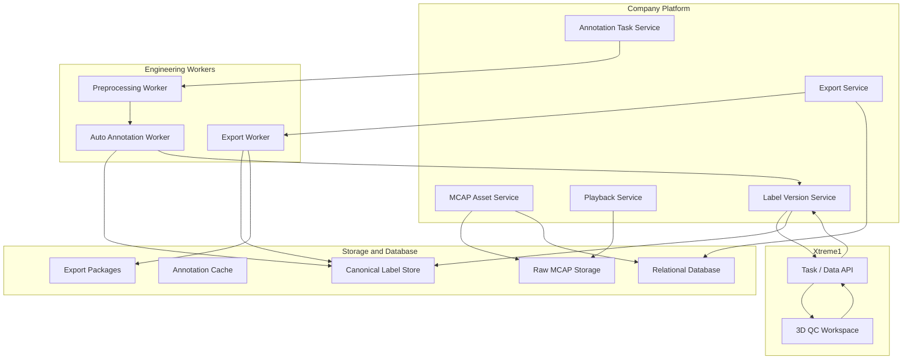

# Design Summary

[简体中文](design-summary.zh-CN.md)

## Design Intent

Phase 1 proves that vehicle-side data can reach the platform. Phase 2 focuses on making that data useful for downstream model development.

The design goal is to create a small but complete annotation production line:

```text
MCAP asset -> platform selection -> automated annotation -> Xtreme1 QC -> final label -> dataset export
```

## Design Decisions

| ID | Decision | Rationale |
|---|---|---|
| D1 | Use whole MCAP assets as the first annotation unit | Keeps Phase 2 simple and avoids complex segment governance too early |
| D2 | Keep MCAP as the raw source of truth | Preserves replayability and future reprocessing capability |
| D3 | Store labels in a canonical internal format | Prevents the platform from being locked to KITTI, nuScenes, or one tool format |
| D4 | Treat automated annotation as draft generation | Draft labels must be reviewed before becoming training data |
| D5 | Use Xtreme1 for 3D quality inspection | Reuses a dedicated 3D annotation and correction tool |
| D6 | Use export adapters for external formats | Adds new formats without changing the core label lifecycle |

## Functional Architecture



## Data Layers

| Layer | Purpose |
|---|---|
| Raw layer | Stores original MCAP assets and package metadata |
| Annotation cache layer | Stores extracted point clouds, images, and mapping files used by Xtreme1 |
| Label layer | Stores canonical labels and label versions |
| Export layer | Stores KITTI, nuScenes, and future exported packages |

## Non-Goals

Phase 2 does not include:

- Model training orchestration.
- Automated test execution.
- Full dataset governance.
- Simulation platform integration.
- Fine-grained segment-level data management as the primary workflow.

