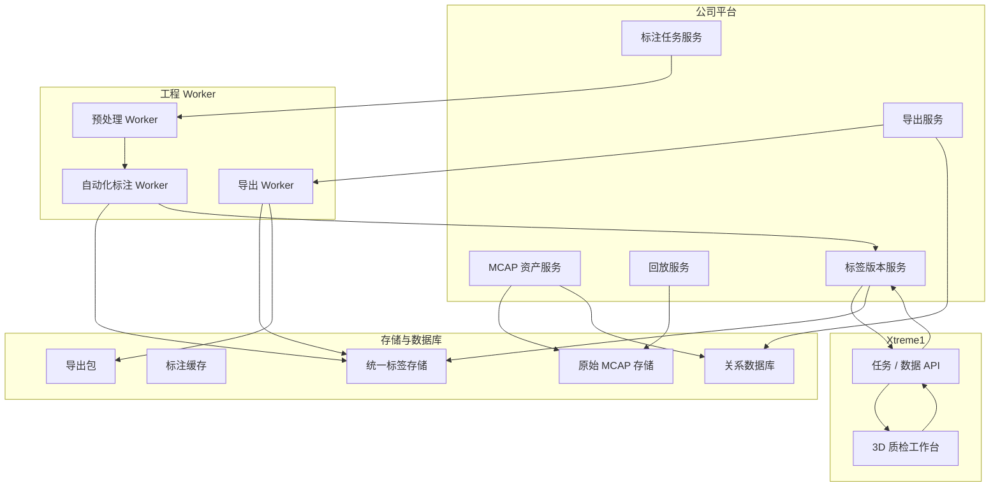

# 设计摘要

[English](design-summary.md)

## 设计意图

阶段一证明了车端数据可以进入平台。阶段二关注的是让这些数据真正可用于后续模型开发。

设计目标是建立一条小而完整的数据标注生产线：

```text
MCAP 资产 -> 平台筛选 -> 自动化标注 -> Xtreme1 质检 -> 最终标签 -> 数据集导出
```

## 设计结论

| 编号 | 设计结论 | 原因 |
|---|---|---|
| D1 | 首期以整包 MCAP 作为标注单位 | 降低二阶段复杂度，避免过早引入复杂片段治理 |
| D2 | MCAP 作为原始数据真源 | 保留回放能力和未来重新处理能力 |
| D3 | 标签先保存为内部统一格式 | 避免平台被 KITTI、nuScenes 或某个工具格式绑定 |
| D4 | 自动化标注只生成草稿标签 | 草稿标签必须经过质检才能作为训练数据 |
| D5 | 使用 Xtreme1 做 3D 质检 | 复用专业 3D 标注和校准工具能力 |
| D6 | 外部格式通过导出适配器生成 | 后续新增格式时不改标签主流程 |

## 功能架构



## 数据分层

| 层级 | 作用 |
|---|---|
| 原始层 | 保存原始 MCAP 资产和数据包元信息 |
| 标注缓存层 | 保存 Xtreme1 使用的点云、图像和映射文件 |
| 标签层 | 保存统一标签和标签版本 |
| 导出层 | 保存 KITTI、nuScenes 和未来格式导出包 |

## 非目标

阶段二不包含：

- 模型训练编排。
- 自动化测试执行。
- 完整数据集治理。
- 仿真平台集成。
- 以片段级数据管理作为主流程。

