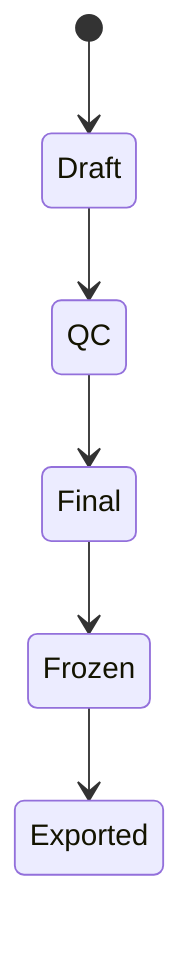
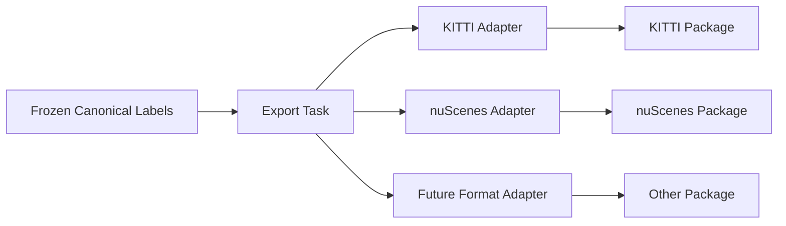

# Label Schema and Export

[简体中文](label-schema-and-export.zh-CN.md)

## Why Canonical Labels

Phase 2 supports KITTI and nuScenes export, but the platform should not store labels directly as either format. A canonical internal format keeps the workflow stable when export formats change.

## Label Lifecycle

| Version | Meaning |
|---|---|
| `draft` | Generated by automated annotation |
| `qc` | Being inspected or corrected |
| `final` | Approved after inspection |
| `frozen` | Locked for export, training, or evaluation |

## Mapping Keys

Labels should be mapped back to source data with stable keys:

| Key | Purpose |
|---|---|
| `mcap_id` | Source MCAP asset |
| `frame_timestamp_ns` | Frame-level time alignment |
| `sensor_name` | Sensor or stream identity |
| `object_id` | Object identity within a frame or track |
| `label_version_id` | Versioned label source |

## Export Design

## Extension Rule

New formats should be added as adapters. They should read canonical labels and write format-specific packages. They should not change the annotation or QC workflow.

