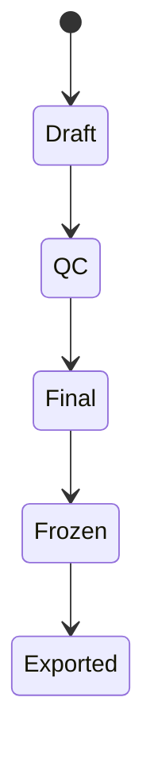
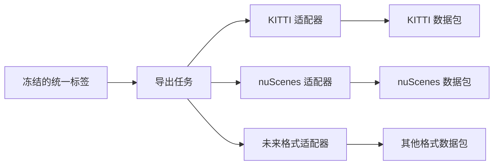

# 标签格式与导出

[English](label-schema-and-export.md)

## 为什么需要统一标签格式

阶段二需要支持 KITTI 和 nuScenes 导出，但平台不应该直接把标签保存成其中某一种格式。内部统一标签格式可以让主流程在外部格式变化时保持稳定。

## 标签生命周期

| 版本 | 含义 |
|---|---|
| `draft` | 自动化标注生成 |
| `qc` | 质检或校准中 |
| `final` | 质检通过后的最终版本 |
| `frozen` | 锁定用于导出、训练或评测 |

## 映射主键

标签需要通过稳定主键映射回源数据：

| 主键 | 作用 |
|---|---|
| `mcap_id` | 来源 MCAP 资产 |
| `frame_timestamp_ns` | 帧级时间对齐 |
| `sensor_name` | 传感器或数据流标识 |
| `object_id` | 帧内或轨迹中的目标标识 |
| `label_version_id` | 标签版本来源 |

## 导出设计

## 扩展规则

新增格式应该通过适配器实现。适配器读取统一标签，写出目标格式数据包，不改变标注或质检主流程。

