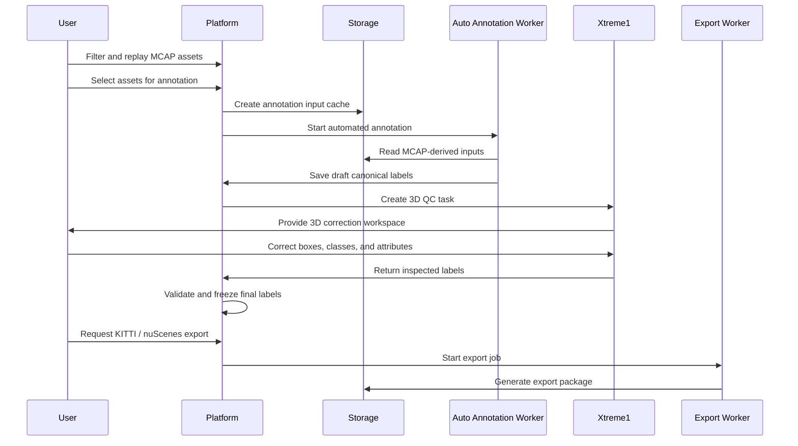

# Workflow

[简体中文](workflow.zh-CN.md)

## Main Flow

## Step 1: MCAP Selection

Users review uploaded MCAP assets on the platform. The first implementation uses whole MCAP packages as the selection unit.

Recommended filters:

- Upload time.
- Vehicle or device alias.
- Event or probe type.
- Duration.
- Package status.
- Playback availability.

## Step 2: Automated Annotation

The platform creates an annotation job and prepares the input required by the annotation worker. The worker runs inference and returns draft labels in the canonical label format.

Draft labels are not final labels. They are traceable intermediate versions.

## Step 3: Xtreme1 Quality Inspection

The platform creates a corresponding Xtreme1 task and imports the required 3D annotation inputs. Human reviewers inspect and correct the automated labels in Xtreme1.

Typical corrections:

- Move or resize 3D boxes.
- Fix classes.
- Add missed objects.
- Remove false positives.
- Update attributes.

## Step 4: Label Finalization

After Xtreme1 results return to the platform, the platform validates the labels, stores a final version, and optionally freezes it for export.

Validation examples:

- Required fields exist.
- Frame timestamps can be mapped back to MCAP data.
- Classes belong to the supported taxonomy.
- Box dimensions are within expected ranges.

## Step 5: Export

The export service reads final canonical labels and generates external packages.

The first public formats are:

- KITTI.
- nuScenes.

Future formats should be implemented as additional adapters.

