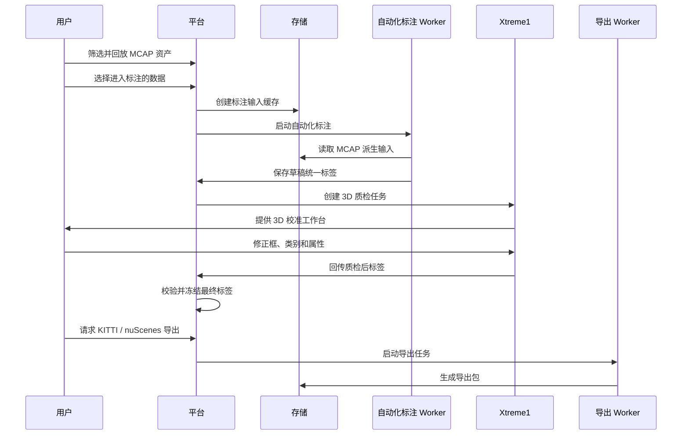

# 业务流程

[English](workflow.md)

## 主流程

## 步骤一：MCAP 筛选

用户在平台上查看已上传的 MCAP 资产。首期实现以整包 MCAP 作为选择单位。

建议筛选维度：

- 上传时间。
- 车辆或设备别名。
- 事件或探针类型。
- 持续时长。
- 数据包状态。
- 回放可用状态。

## 步骤二：自动化标注

平台创建标注任务，并准备自动化标注 Worker 需要的输入。Worker 执行推理后，将结果保存为内部统一标签格式。

草稿标签不是最终标签，而是一个可追溯的中间版本。

## 步骤三：Xtreme1 质检

平台创建对应的 Xtreme1 任务，并导入 3D 标注所需输入。质检人员在 Xtreme1 中检查并修正自动化标注结果。

典型修正包括：

- 移动或缩放 3D 框。
- 修正类别。
- 新增漏标目标。
- 删除误检目标。
- 修改属性。

## 步骤四：标签定稿

Xtreme1 结果回传平台后，平台对标签进行校验，保存最终版本，并在需要时冻结用于导出。

校验示例：

- 必填字段存在。
- 帧时间戳可以映射回 MCAP 数据。
- 类别属于受支持的标签体系。
- 3D 框尺寸处于合理范围。

## 步骤五：导出

导出服务读取最终统一标签并生成外部格式包。

首期公开格式：

- KITTI。
- nuScenes。

未来格式应通过新增适配器实现。

