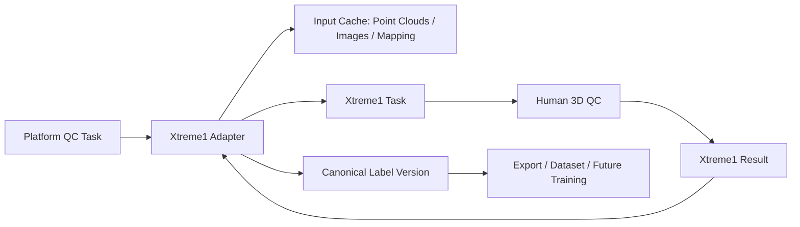
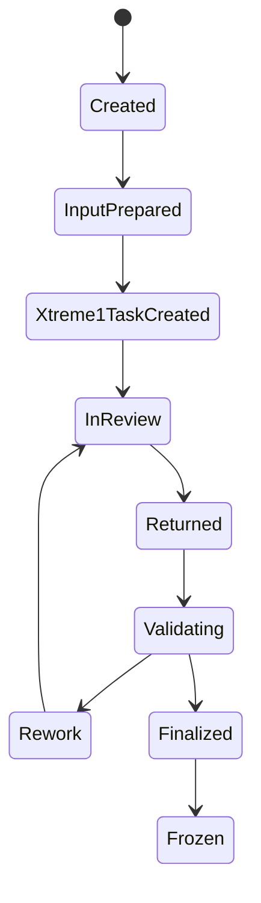

# Xtreme1 Integration

[简体中文](xtreme1-integration.zh-CN.md)

## Role of Xtreme1

Xtreme1 is used as the 3D quality inspection and manual correction workspace. The platform remains the owner of workflow state, label versions, and exported results.

This boundary is important:

- Xtreme1 provides the editing experience.
- The platform provides task orchestration, traceability, validation, and final label storage.

## Integration Boundary

## Adapter Responsibilities

| Responsibility | Description |
|---|---|
| Task creation | Create Xtreme1 tasks from platform QC tasks |
| Data import | Import point clouds, images, and mapping metadata |
| Draft preload | Preload automated annotation results as editable labels |
| Result retrieval | Fetch corrected labels after QC |
| Mapping recovery | Map corrected labels back to MCAP asset IDs and timestamps |
| Error handling | Track failures and make tasks retryable |

## Task Binding

The platform should store explicit bindings:

| Field | Purpose |
|---|---|
| `qc_task_id` | Platform-side QC task ID |
| `xtreme1_project_id` | Xtreme1 project or workspace ID |
| `xtreme1_task_id` | Xtreme1 task ID |
| `source_mcap_id` | Source MCAP asset |
| `draft_label_version_id` | Automated annotation draft |
| `final_label_version_id` | Final platform label version |

## Recommended State Machine

## What Not to Do

- Do not treat Xtreme1's internal database as the platform's final label source.
- Do not export training labels directly from tool-specific intermediate data.
- Do not rely on file names alone to map labels back to MCAP frames.

