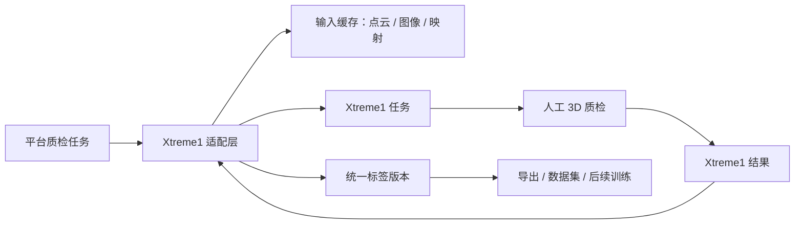
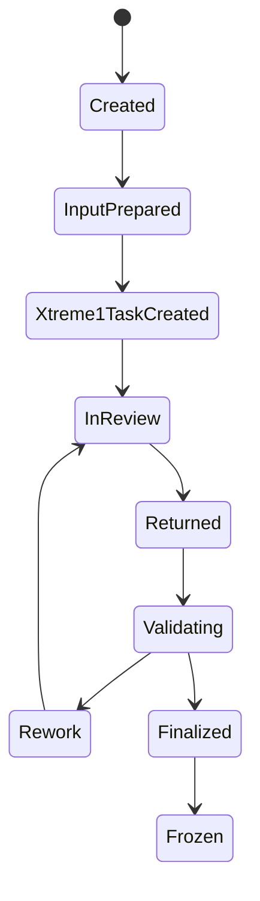

# Xtreme1 集成

[English](xtreme1-integration.md)

## Xtreme1 的角色

Xtreme1 用作 3D 质检和人工校准工作台。平台仍然负责流程状态、标签版本和最终导出结果。

这个边界很重要：

- Xtreme1 提供编辑体验。
- 平台提供任务编排、追溯、校验和最终标签存储。

## 集成边界

## 适配层职责

| 职责 | 说明 |
|---|---|
| 任务创建 | 根据平台质检任务创建 Xtreme1 任务 |
| 数据导入 | 导入点云、图像和映射元数据 |
| 草稿预加载 | 将自动化标注结果预加载为可编辑标签 |
| 结果回收 | 在质检完成后拉取修正后的标签 |
| 映射恢复 | 将修正结果映射回 MCAP 资产 ID 和时间戳 |
| 异常处理 | 跟踪失败并支持任务重试 |

## 任务绑定

平台需要保存显式绑定关系：

| 字段 | 作用 |
|---|---|
| `qc_task_id` | 平台侧质检任务 ID |
| `xtreme1_project_id` | Xtreme1 项目或工作空间 ID |
| `xtreme1_task_id` | Xtreme1 任务 ID |
| `source_mcap_id` | 来源 MCAP 资产 |
| `draft_label_version_id` | 自动化标注草稿版本 |
| `final_label_version_id` | 平台最终标签版本 |

## 推荐状态机

## 不建议这样做

- 不要把 Xtreme1 内部数据库当成平台最终标签真源。
- 不要直接从工具中间格式导出训练标签。
- 不要只靠文件名把标签映射回 MCAP 帧。

