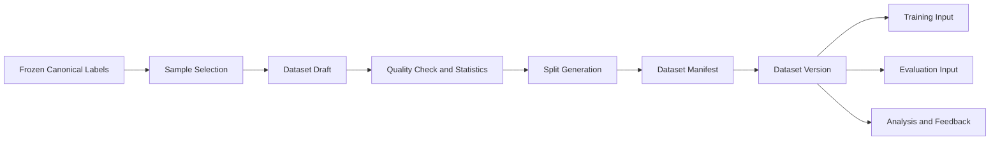

# Phase 3: Dataset Management

[简体中文](README.zh-CN.md)

Phase 3 turns finalized labels from Phase 2 into versioned datasets that can be reused by model training, automated evaluation, analysis, and future feedback loops.

The key idea is to treat datasets as managed engineering artifacts rather than temporary file folders. A dataset version should clearly describe what data it contains, which label versions it depends on, how it is split, why it was created, and which downstream tasks used it.

## Goals

- Build dataset versions from frozen canonical labels.
- Support sample selection, filtering, and split management.
- Keep dataset manifests as reproducible records.
- Track lineage from dataset versions back to MCAP assets and label versions.
- Produce quality statistics before training or evaluation.
- Prepare clean interfaces for Phase 4 model training and Phase 5 automated evaluation.

## Scope

| Area | Phase 3 capability |
|---|---|
| Dataset versioning | Create immutable dataset versions from selected labeled assets |
| Sample management | Track sample IDs, source MCAP IDs, timestamps, sensors, and label versions |
| Split management | Maintain train/val/test splits and scenario-based subsets |
| Manifest | Generate reproducible dataset manifests |
| Quality statistics | Count classes, frames, scenarios, missing labels, and split distribution |
| Lineage | Link datasets to source data, label versions, exports, training jobs, and evaluation jobs |

## Dataset Flow

## Key Documents

- [Design Summary](design-summary.md)
- [Dataset Lifecycle](dataset-lifecycle.md)
- [Manifest and Lineage](manifest-and-lineage.md)
- [Quality and Sampling](quality-and-sampling.md)
- [Development Plan](development-plan.md)

## Public Examples

- [Dataset manifest example](../../examples/manifest/phase3-dataset-manifest.example.json)
- [Dataset sample index example](../../examples/metadata/dataset-sample-index.example.json)
- [Dataset split config example](../../examples/manifest/phase3-split-config.example.json)
- [Dataset manifest builder demo](../../src-demo/dataset-manifest-demo/README.md)

## Status

Completed.
