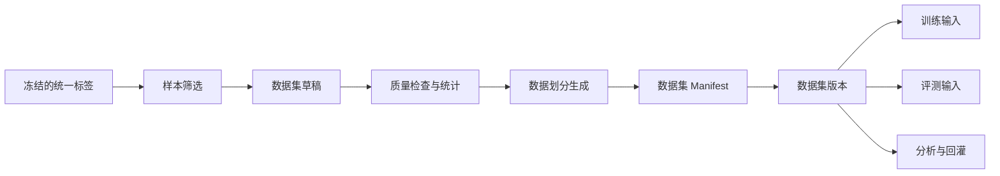

# 阶段三：数据集管理

[English](README.md)

阶段三将阶段二产出的最终标签沉淀为版本化数据集，供模型训练、自动化评测、数据分析和后续问题回灌复用。

核心思路是：不要把数据集当成临时文件夹，而要把它作为可管理的工程产物。一个数据集版本应该清楚描述包含哪些数据、依赖哪些标签版本、如何划分训练/验证/测试集、为什么创建，以及被哪些下游任务使用过。

## 目标

- 基于冻结后的统一标签构建数据集版本。
- 支持样本筛选、过滤和划分管理。
- 使用数据集 manifest 保证可复现。
- 追踪数据集版本到 MCAP 资产和标签版本的血缘关系。
- 在训练或评测前产出质量统计。
- 为阶段四模型训练和阶段五自动化评测提供干净接口。

## 范围

| 领域 | 阶段三能力 |
|---|---|
| 数据集版本 | 从选定的已标注资产创建不可变数据集版本 |
| 样本管理 | 记录样本 ID、来源 MCAP、时间戳、传感器和标签版本 |
| 划分管理 | 维护 train/val/test 划分和按场景组织的子集 |
| Manifest | 生成可复现的数据集 manifest |
| 质量统计 | 统计类别、帧数、场景、缺失标签和划分分布 |
| 血缘追踪 | 连接数据集与源数据、标签版本、导出、训练任务和评测任务 |

## 数据集流程

## 关键文档

- [设计摘要](design-summary.zh-CN.md)
- [数据集生命周期](dataset-lifecycle.zh-CN.md)
- [Manifest 与血缘关系](manifest-and-lineage.zh-CN.md)
- [质量统计与样本筛选](quality-and-sampling.zh-CN.md)
- [开发计划](development-plan.zh-CN.md)

## 公开示例

- [数据集 manifest 示例](../../examples/manifest/phase3-dataset-manifest.example.json)
- [数据集样本索引示例](../../examples/metadata/dataset-sample-index.example.json)
- [数据划分配置示例](../../examples/manifest/phase3-split-config.example.json)
- [数据集 manifest 生成 demo](../../src-demo/dataset-manifest-demo/README.zh-CN.md)

## 状态

已完成。
