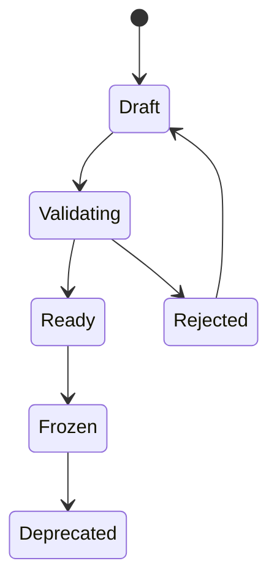

# Dataset Lifecycle

[简体中文](dataset-lifecycle.zh-CN.md)

## Lifecycle Overview

| State | Meaning |
|---|---|
| `draft` | Dataset membership is still being edited |
| `validating` | Quality checks and split checks are running |
| `ready` | Dataset has passed checks and can be reviewed |
| `frozen` | Dataset version is immutable and can be used by training/evaluation |
| `deprecated` | Dataset is kept for traceability but should not be used for new jobs |
| `rejected` | Dataset failed checks and needs correction |

## Creation Flow

1. Select frozen label versions from Phase 2.
2. Build a sample index from MCAP IDs, timestamps, sensors, and label versions.
3. Apply filters and scenario tags.
4. Generate train/validation/test splits.
5. Run quality statistics.
6. Generate a dataset manifest.
7. Freeze the dataset version.

## Immutability Rule

Once a dataset version is frozen, do not modify its membership, splits, or label references. Any change should create a new dataset version.

This keeps training and evaluation results reproducible.

