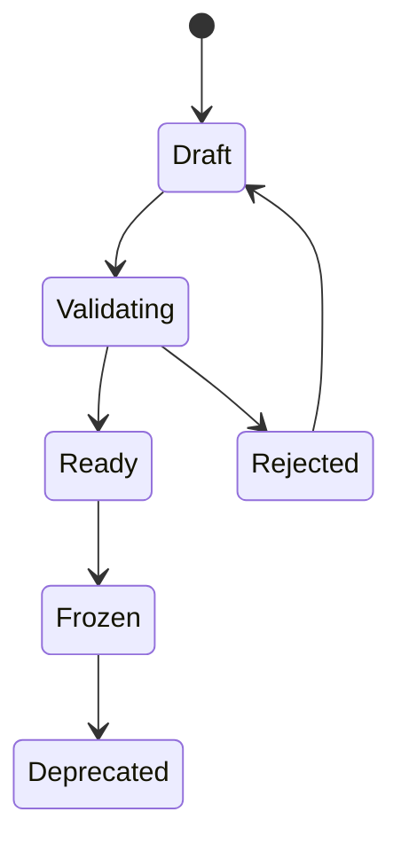

# 数据集生命周期

[English](dataset-lifecycle.md)

## 生命周期总览

| 状态 | 含义 |
|---|---|
| `draft` | 数据集成员仍在编辑 |
| `validating` | 正在执行质量检查和划分检查 |
| `ready` | 数据集通过检查，可进入评审 |
| `frozen` | 数据集版本不可变，可用于训练或评测 |
| `deprecated` | 为追溯保留，但不建议用于新任务 |
| `rejected` | 检查未通过，需要修正 |

## 创建流程

1. 选择阶段二冻结后的标签版本。
2. 基于 MCAP ID、时间戳、传感器和标签版本构建样本索引。
3. 应用过滤条件和场景标签。
4. 生成 train/validation/test 划分。
5. 运行质量统计。
6. 生成数据集 manifest。
7. 冻结数据集版本。

## 不可变规则

数据集版本一旦冻结，不再修改成员、划分或标签引用。任何变化都应创建新的数据集版本。

这样可以保证训练和评测结果可复现。

