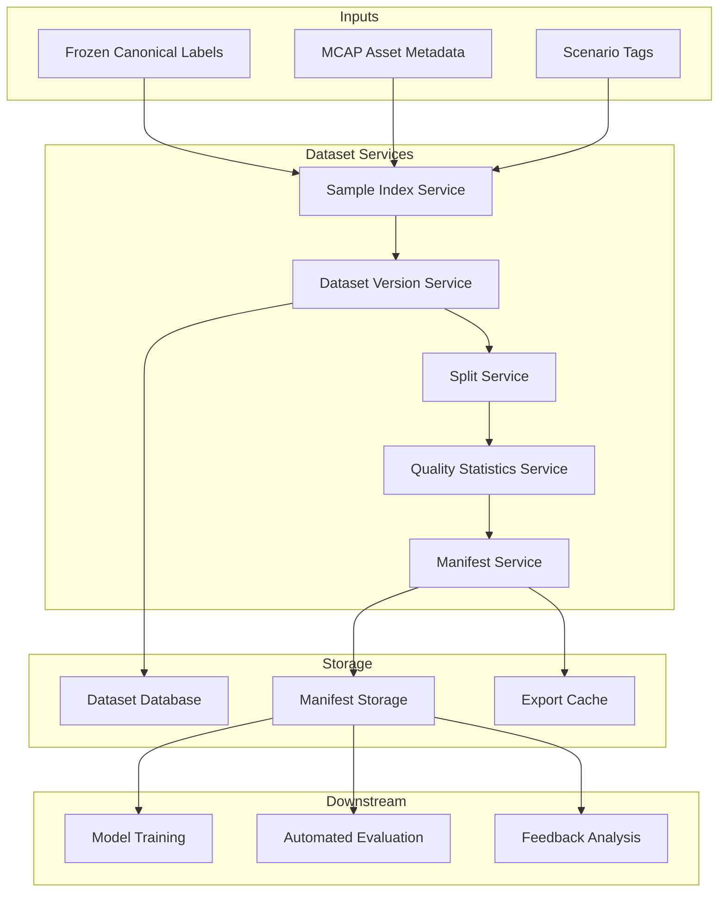

# Design Summary

[简体中文](design-summary.zh-CN.md)

## Design Intent

Phase 2 produces final labels. Phase 3 organizes those labels and their source data into reusable dataset versions.

The dataset layer is the bridge between annotation and training. Without a dataset management layer, model training often depends on ad hoc file folders, unclear label versions, and hard-to-reproduce sample selections.

## Core Decisions

| ID | Decision | Rationale |
|---|---|---|
| D1 | Use dataset versions as immutable artifacts | Training and evaluation need reproducible inputs |
| D2 | Store dataset membership through sample indexes | Avoid copying large raw data repeatedly |
| D3 | Use manifests as the dataset contract | Downstream jobs can consume a stable, inspectable input |
| D4 | Keep lineage to MCAP and label versions | Every model result should be traceable back to data and labels |
| D5 | Separate selection, splitting, and export | Each step can evolve independently |
| D6 | Keep scenario tags optional but extensible | The first version can work with basic metadata and later support richer scenario discovery |

## Functional Architecture

## Main Entities

| Entity | Description |
|---|---|
| `dataset` | Logical dataset definition, such as "urban perception 3D v1" |
| `dataset_version` | Immutable version with fixed membership, splits, labels, and manifest |
| `dataset_sample` | One reusable sample linked to source MCAP, timestamp, sensors, and label version |
| `dataset_split` | Train/validation/test membership |
| `dataset_manifest` | File-based contract consumed by training and evaluation |
| `dataset_lineage` | Trace from dataset version to source data, labels, exports, models, and evaluation jobs |

## Non-Goals

Phase 3 does not implement:

- Model training itself.
- Automated evaluation itself.
- A full feature store.
- Complex active learning algorithms.
- Heavyweight data governance beyond what is required for dataset reproducibility.
