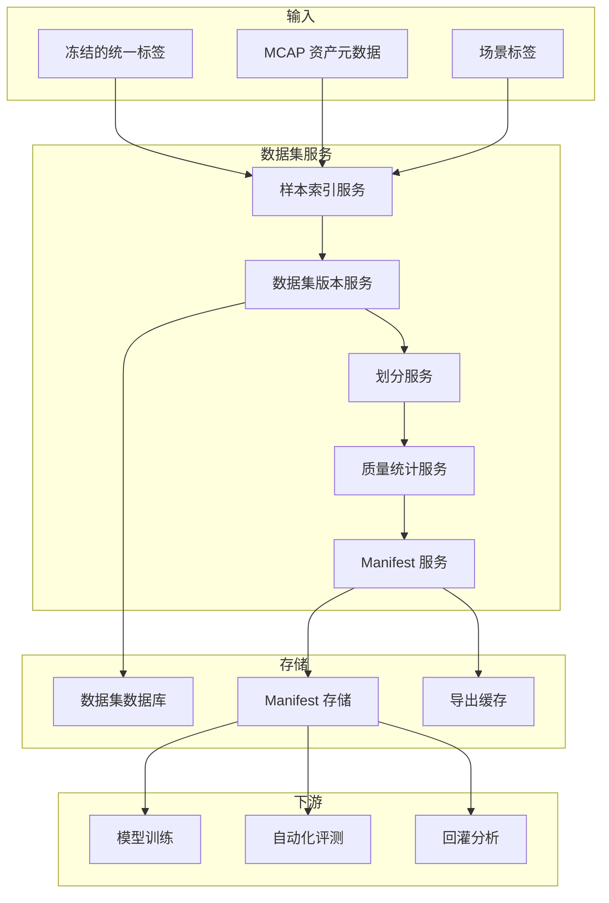

# 设计摘要

[English](design-summary.md)

## 设计意图

阶段二产出最终标签。阶段三负责把这些标签和对应源数据组织成可复用的数据集版本。

数据集层是标注和训练之间的桥梁。如果缺少数据集管理层，模型训练往往会依赖临时文件夹、不清晰的标签版本和难以复现的样本选择。

## 核心设计结论

| 编号 | 设计结论 | 原因 |
|---|---|---|
| D1 | 将数据集版本作为不可变产物 | 训练和评测需要可复现输入 |
| D2 | 通过样本索引维护数据集成员 | 避免反复复制大规模原始数据 |
| D3 | 使用 manifest 作为数据集契约 | 下游任务可以消费稳定、可检查的输入 |
| D4 | 保留到 MCAP 和标签版本的血缘关系 | 每个模型结果都应能追溯到数据和标签 |
| D5 | 将筛选、划分和导出解耦 | 各步骤可以独立演进 |
| D6 | 场景标签可选但可扩展 | 首版可基于基础元数据运行，后续再支持更丰富的场景挖掘 |

## 功能架构

## 主要实体

| 实体 | 说明 |
|---|---|
| `dataset` | 逻辑数据集定义，例如“通用感知 3D v1” |
| `dataset_version` | 不可变版本，固定成员、划分、标签和 manifest |
| `dataset_sample` | 可复用样本，关联来源 MCAP、时间戳、传感器和标签版本 |
| `dataset_split` | train/validation/test 成员关系 |
| `dataset_manifest` | 训练和评测消费的文件化契约 |
| `dataset_lineage` | 从数据集版本到源数据、标签、导出、模型和评测任务的追踪关系 |

## 非目标

阶段三不实现：

- 模型训练本身。
- 自动化评测本身。
- 完整特征库。
- 复杂主动学习算法。
- 超出数据集可复现所需的重型数据治理能力。

