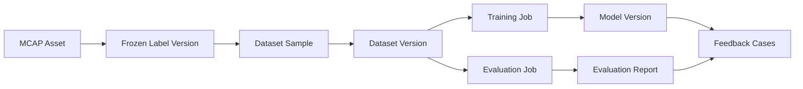

# Manifest and Lineage

[简体中文](manifest-and-lineage.zh-CN.md)

## Manifest Purpose

A dataset manifest is the contract between the dataset system and downstream consumers. It should be explicit enough for a training or evaluation job to reproduce the same input.

## Manifest Should Include

| Field | Purpose |
|---|---|
| `dataset_id` | Logical dataset identity |
| `dataset_version_id` | Immutable version identity |
| `created_at` | Version creation time |
| `source_label_versions` | Label versions used to build the dataset |
| `samples` | Sample list or pointer to a sample index |
| `splits` | Train/validation/test membership |
| `statistics` | Class, frame, scenario, and split statistics |
| `lineage` | Source MCAP, labels, export jobs, and downstream usage |

## Lineage Graph

## Why Lineage Matters

Lineage lets the team answer:

- Which data produced this model?
- Which label version was used?
- Which dataset version was used for training or evaluation?
- Can this result be reproduced?
- Which failed cases should be fed back to data collection?

