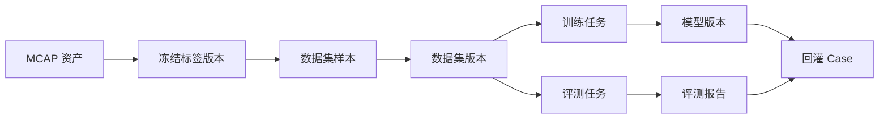

# Manifest 与血缘关系

[English](manifest-and-lineage.md)

## Manifest 的作用

数据集 manifest 是数据集系统和下游消费者之间的契约。它需要足够明确，使训练或评测任务能够复现同一份输入。

## Manifest 应包含

| 字段 | 作用 |
|---|---|
| `dataset_id` | 逻辑数据集标识 |
| `dataset_version_id` | 不可变版本标识 |
| `created_at` | 版本创建时间 |
| `source_label_versions` | 构建数据集使用的标签版本 |
| `samples` | 样本列表或样本索引指针 |
| `splits` | train/validation/test 成员关系 |
| `statistics` | 类别、帧数、场景和划分统计 |
| `lineage` | 来源 MCAP、标签、导出任务和下游使用记录 |

## 血缘关系图

## 为什么血缘关系重要

血缘关系可以帮助团队回答：

- 这个模型由哪些数据产生？
- 使用了哪个标签版本？
- 训练或评测使用了哪个数据集版本？
- 这个结果是否可以复现？
- 哪些失败 case 应该回灌到数据采集？

