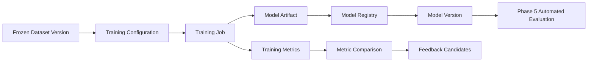

# Phase 4: Model Training

[简体中文](README.zh-CN.md)

Phase 4 connects versioned datasets from Phase 3 to perception model training, model registry, metric tracking, and data-to-model traceability.

This phase does not try to publish real model code or proprietary training pipelines. In this public repository, it focuses on the architecture and contracts that make model training reproducible and reviewable.

## Goals

- Select frozen dataset versions as training inputs.
- Manage training jobs, training configurations, and runtime metadata.
- Register model artifacts with dataset and label lineage.
- Track metrics across model versions.
- Compare model versions by dataset, scenario, class, and evaluation result.
- Prepare model outputs for Phase 5 automated evaluation.

## Scope

| Area | Phase 4 capability |
|---|---|
| Training input | Consume frozen dataset manifests from Phase 3 |
| Training job | Track job configuration, status, runtime, logs, and artifacts |
| Model registry | Register model versions and link them to dataset versions |
| Metrics | Store training and validation metrics with structured dimensions |
| Comparison | Compare model versions and identify regressions |
| Lineage | Trace model versions back to dataset, label versions, and source MCAP assets |

## Training Flow

## Key Documents

- [Design Summary](design-summary.md)
- [Training Workflow](training-workflow.md)
- [Model Registry and Lineage](model-registry-and-lineage.md)
- [Metrics and Comparison](metrics-and-comparison.md)
- [Development Plan](development-plan.md)

## Public Examples

- [Training config example](../../examples/training/training-config.example.json)
- [Training job example](../../examples/training/training-job.example.json)
- [Model metrics example](../../examples/training/model-metrics.example.json)
- [Model card example](../../examples/training/model-card.example.json)
- [Model card builder demo](../../src-demo/model-card-demo/README.md)

## Status

Planned.

