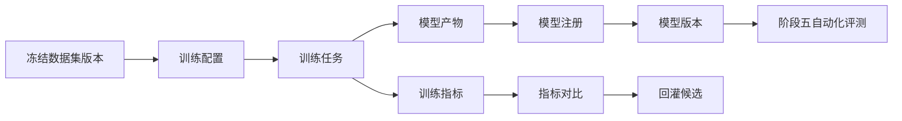

# 阶段四：模型训练

[English](README.md)

阶段四将阶段三的版本化数据集连接到感知模型训练、模型注册、指标跟踪和数据到模型的追溯关系。

这一阶段不在公开仓库中发布真实模型代码或公司训练流水线，而是重点展示让模型训练可复现、可审查、可追溯所需的架构和契约。

## 目标

- 选择冻结后的数据集版本作为训练输入。
- 管理训练任务、训练配置和运行时元信息。
- 注册模型产物，并关联数据集和标签血缘。
- 跟踪不同模型版本的指标。
- 按数据集、场景、类别和评测结果对比模型版本。
- 为阶段五自动化评测准备模型输出。

## 范围

| 领域 | 阶段四能力 |
|---|---|
| 训练输入 | 消费阶段三冻结后的数据集 manifest |
| 训练任务 | 跟踪任务配置、状态、运行环境、日志和产物 |
| 模型注册 | 注册模型版本，并关联数据集版本 |
| 指标管理 | 按结构化维度保存训练和验证指标 |
| 版本对比 | 对比模型版本并识别回退 |
| 血缘追溯 | 从模型版本追溯到数据集、标签版本和来源 MCAP 资产 |

## 训练流程

## 关键文档

- [设计摘要](design-summary.zh-CN.md)
- [训练流程](training-workflow.zh-CN.md)
- [模型注册与血缘关系](model-registry-and-lineage.zh-CN.md)
- [指标与版本对比](metrics-and-comparison.zh-CN.md)
- [开发计划](development-plan.zh-CN.md)

## 公开示例

- [训练配置示例](../../examples/training/training-config.example.json)
- [训练任务示例](../../examples/training/training-job.example.json)
- [模型指标示例](../../examples/training/model-metrics.example.json)
- [模型卡片示例](../../examples/training/model-card.example.json)
- [模型卡片生成 demo](../../src-demo/model-card-demo/README.zh-CN.md)

## 状态

规划中。

