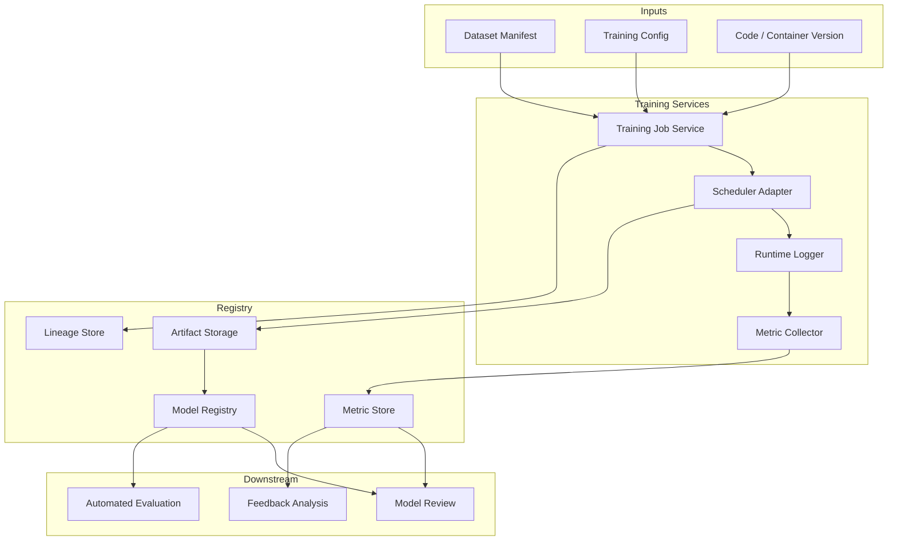

# Design Summary

[简体中文](design-summary.zh-CN.md)

## Design Intent

Phase 4 is the bridge from curated datasets to model versions. The goal is to make model training reproducible, comparable, and traceable.

The system should be able to answer:

- Which dataset version trained this model?
- Which configuration and code version were used?
- Which metrics improved or regressed?
- Which model should move to automated evaluation?
- Which failed scenarios should be sent back to data collection later?

## Core Decisions

| ID | Decision | Rationale |
|---|---|---|
| D1 | Training jobs consume frozen dataset manifests | Prevents training from depending on mutable file folders |
| D2 | Training configuration is versioned | Makes experiments reproducible |
| D3 | Model artifacts are registered as model versions | Enables comparison, release review, and evaluation |
| D4 | Metrics are stored with dimensions | Overall metrics are not enough for perception model analysis |
| D5 | Model lineage links back to datasets and labels | Supports root-cause analysis and future feedback loops |
| D6 | Phase 4 prepares, but does not execute, automated evaluation | Evaluation is handled by Phase 5 |

## Functional Architecture

## Main Entities

| Entity | Description |
|---|---|
| `training_config` | Versioned training hyperparameters, model architecture, runtime requirements |
| `training_job` | One execution record with dataset, config, status, logs, and outputs |
| `model_artifact` | Stored model file, checkpoint, or export package |
| `model_version` | Registered model identity that can be compared and evaluated |
| `metric_record` | Structured training, validation, and scenario metrics |
| `model_lineage` | Relationship from model version to dataset, labels, config, and code |

## Non-Goals

Phase 4 does not include:

- Publishing real model source code.
- Publishing model weights.
- Building a full MLOps platform.
- Automated closed-loop evaluation, which belongs to Phase 5.
- Online deployment and release governance.

