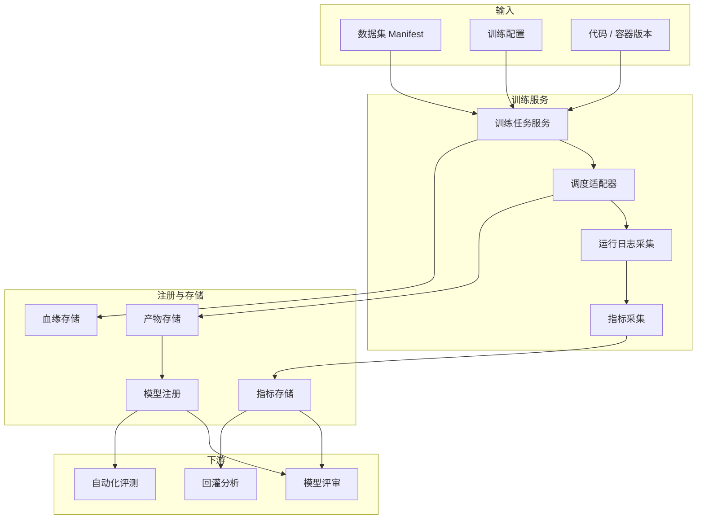

# 设计摘要

[English](design-summary.md)

## 设计意图

阶段四是从高质量数据集到模型版本的桥梁，目标是让模型训练具备可复现、可对比和可追溯能力。

系统应该能够回答：

- 这个模型使用哪个数据集版本训练？
- 使用了哪个训练配置和代码版本？
- 哪些指标提升了，哪些指标回退了？
- 哪个模型应该进入自动化评测？
- 哪些失败场景后续需要回灌到数据采集？

## 核心设计结论

| 编号 | 设计结论 | 原因 |
|---|---|---|
| D1 | 训练任务消费冻结后的数据集 manifest | 避免训练依赖可变的临时文件夹 |
| D2 | 训练配置需要版本化 | 保证实验可复现 |
| D3 | 模型产物注册为模型版本 | 支持版本对比、发布评审和自动化评测 |
| D4 | 指标按维度结构化保存 | 感知模型分析不能只看总体指标 |
| D5 | 模型血缘追溯到数据集和标签 | 支持问题定位和后续回灌 |
| D6 | 阶段四准备自动化评测输入，但不执行评测 | 评测执行属于阶段五 |

## 功能架构

## 主要实体

| 实体 | 说明 |
|---|---|
| `training_config` | 版本化训练超参、模型结构和运行环境要求 |
| `training_job` | 一次训练执行记录，包含数据集、配置、状态、日志和输出 |
| `model_artifact` | 模型文件、checkpoint 或导出包 |
| `model_version` | 可对比、可评测的注册模型版本 |
| `metric_record` | 结构化训练、验证和场景指标 |
| `model_lineage` | 从模型版本到数据集、标签、配置和代码的关系 |

## 非目标

阶段四不包含：

- 公开真实模型源码。
- 公开模型权重。
- 建设完整 MLOps 平台。
- 自动化闭环评测，评测属于阶段五。
- 在线部署和发布治理。

