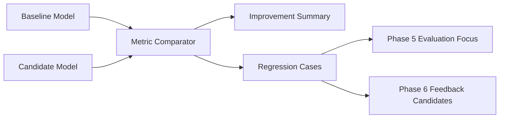

# Metrics and Comparison

[简体中文](metrics-and-comparison.zh-CN.md)

## Metric Layers

Model training should not only track a single overall score. Metrics should be layered:

| Layer | Examples |
|---|---|
| Overall | mAP, precision, recall, F1 |
| Class | car, truck, pedestrian, cyclist |
| Range | near, middle, far |
| Scenario | daytime, night, intersection, dense traffic |
| Split | train, validation, test |
| Regression | improved, unchanged, regressed |

## Comparison Flow

## Readiness Criteria

A model can enter Phase 5 automated evaluation when:

- Training job succeeded.
- Model artifact is registered.
- Required metrics are available.
- No blocking regression is detected in validation metrics.
- Dataset and label lineage are complete.

## Why This Matters

Without structured metrics and comparison, model iteration can become anecdotal. Phase 4 turns training output into an engineering decision: whether a model is better, where it is better, where it regressed, and what should be evaluated next.

