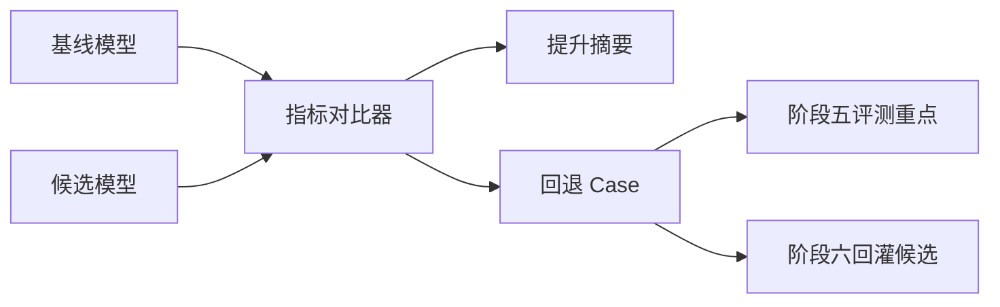

# 指标与版本对比

[English](metrics-and-comparison.md)

## 指标层级

模型训练不应该只记录一个总体分数，指标需要分层：

| 层级 | 示例 |
|---|---|
| 总体 | mAP、precision、recall、F1 |
| 类别 | car、truck、pedestrian、cyclist |
| 距离 | 近距离、中距离、远距离 |
| 场景 | 白天、夜间、路口、密集交通 |
| 划分 | train、validation、test |
| 回退 | 提升、持平、回退 |

## 对比流程

## 评测就绪标准

模型进入阶段五自动化评测前，应满足：

- 训练任务成功完成。
- 模型产物已注册。
- 必要指标已生成。
- 验证指标中没有阻塞级回退。
- 数据集和标签血缘完整。

## 价值

如果缺少结构化指标和版本对比，模型迭代很容易变成凭感觉判断。阶段四把训练输出转化为工程决策：模型是否变好、在哪些地方变好、哪里发生回退，以及下一步应该评测什么。

