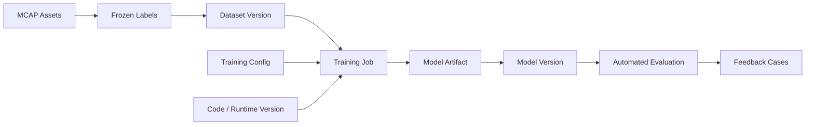

# Model Registry and Lineage

[简体中文](model-registry-and-lineage.zh-CN.md)

## Registry Purpose

The model registry records which model versions exist, where their artifacts are stored, which dataset versions trained them, and whether they are ready for automated evaluation.

## Lineage Graph

## Model Version Metadata

| Field | Purpose |
|---|---|
| `model_version_id` | Stable model version identity |
| `model_family` | Perception model family or task type |
| `dataset_version_id` | Training dataset version |
| `training_config_id` | Training config version |
| `code_version` | Code or container version |
| `artifact_uri` | Model artifact storage path |
| `metric_summary` | Key metrics for review |
| `readiness` | Whether the model can enter evaluation |

## Model Card

A model card is a human-readable summary that should include:

- Model identity.
- Training data.
- Training configuration.
- Key metrics.
- Known limitations.
- Evaluation readiness.
- Lineage links.

