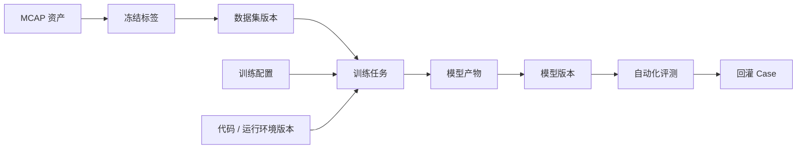

# 模型注册与血缘关系

[English](model-registry-and-lineage.md)

## 模型注册的作用

模型注册用于记录有哪些模型版本、产物存在哪里、使用哪个数据集版本训练，以及是否可以进入自动化评测。

## 血缘关系图

## 模型版本元数据

| 字段 | 作用 |
|---|---|
| `model_version_id` | 稳定模型版本标识 |
| `model_family` | 感知模型族或任务类型 |
| `dataset_version_id` | 训练数据集版本 |
| `training_config_id` | 训练配置版本 |
| `code_version` | 代码或容器版本 |
| `artifact_uri` | 模型产物存储路径 |
| `metric_summary` | 评审所需核心指标 |
| `readiness` | 是否可以进入评测 |

## 模型卡片

模型卡片是面向人工评审的摘要，应包含：

- 模型身份。
- 训练数据。
- 训练配置。
- 核心指标。
- 已知限制。
- 评测就绪状态。
- 血缘链接。

