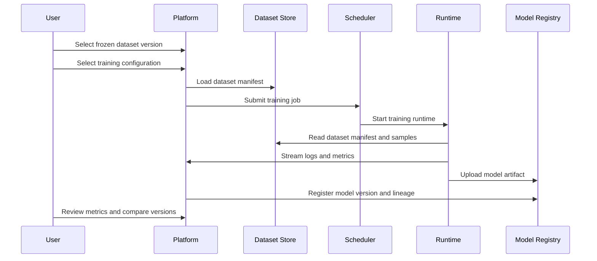
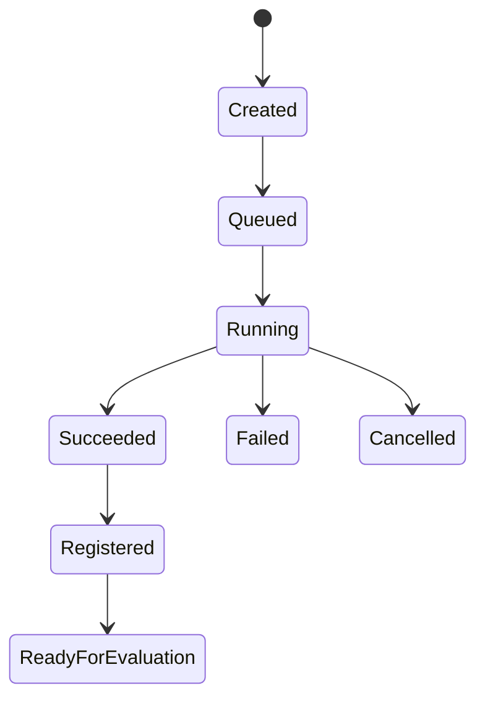

# Training Workflow

[简体中文](training-workflow.zh-CN.md)

## Main Workflow

## Training Job States

## Required Inputs

| Input | Description |
|---|---|
| Dataset manifest | Frozen dataset version from Phase 3 |
| Training config | Model architecture, hyperparameters, runtime, and output rules |
| Runtime image | Container or environment version |
| Code version | Git commit, package version, or release ID |

## Required Outputs

| Output | Description |
|---|---|
| Model artifact | Checkpoint, exported model, or runtime package |
| Metrics | Training, validation, and scenario-level metrics |
| Logs | Runtime logs and failure reason |
| Model card | Human-readable summary of lineage, metrics, and readiness |

