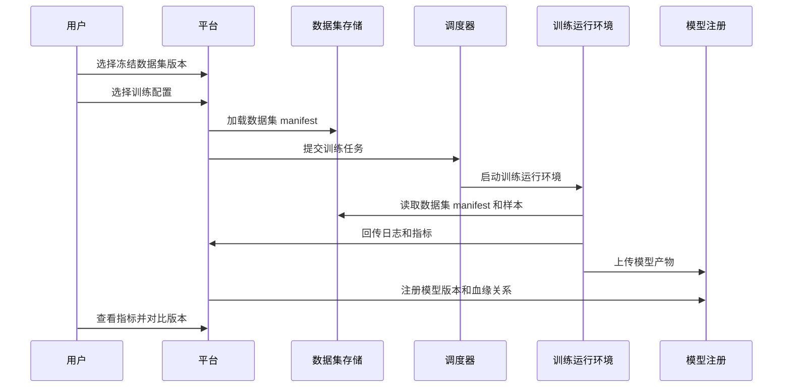
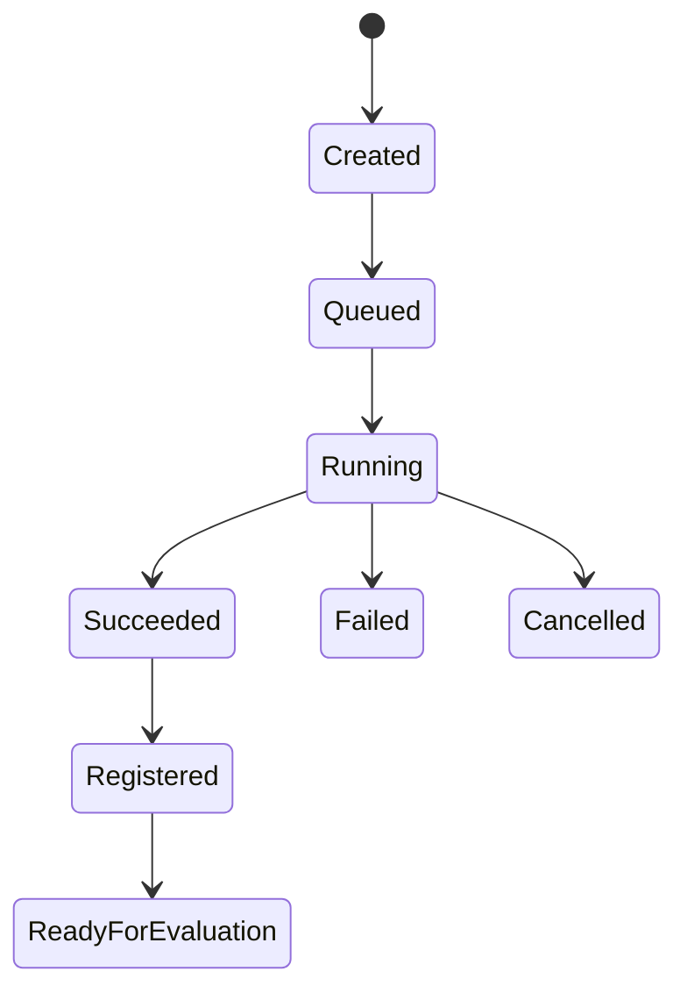

# 训练流程

[English](training-workflow.md)

## 主流程

## 训练任务状态

## 必要输入

| 输入 | 说明 |
|---|---|
| 数据集 manifest | 阶段三冻结后的数据集版本 |
| 训练配置 | 模型结构、超参、运行环境和输出规则 |
| 运行镜像 | 容器或环境版本 |
| 代码版本 | Git commit、包版本或 release ID |

## 必要输出

| 输出 | 说明 |
|---|---|
| 模型产物 | checkpoint、导出模型或运行包 |
| 指标 | 训练、验证和场景级指标 |
| 日志 | 运行日志和失败原因 |
| 模型卡片 | 面向人工评审的血缘、指标和就绪状态摘要 |

