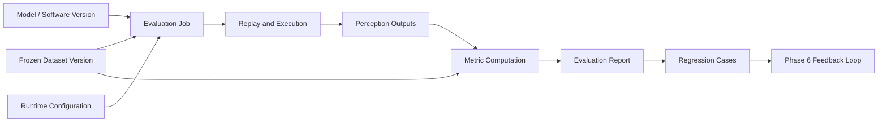

# Phase 5: Automated Test and Evaluation

[简体中文](README.zh-CN.md)

Phase 5 evaluates model or perception software versions with fixed datasets, ground-truth labels, replayed sensor data, structured metrics, and reproducible reports.

The purpose is different from Phase 4 model training. Training changes the model. Automated evaluation does not change the model; it proves whether a candidate model or software version is good enough, where it improves, where it regresses, and which failed cases should be sent into the feedback loop.

## Goals

- Select frozen dataset versions and model/software versions for evaluation.
- Replay MCAP or dataset-derived samples into a target runtime.
- Collect perception outputs in a structured format.
- Compare perception outputs against frozen canonical labels.
- Generate metrics, failed cases, and regression summaries.
- Provide candidates for Phase 6 feedback-driven collection.

## Scope

| Area | Phase 5 capability |
|---|---|
| Evaluation input | Frozen dataset manifest, labels, model version, runtime config |
| Replay | Feed MCAP or extracted samples to a target runtime |
| Runtime execution | Run perception software in container, server, or embedded runtime |
| Output collection | Collect predictions, logs, and runtime status |
| Metric computation | Compare predictions with ground-truth labels |
| Reporting | Generate structured reports and failed-case lists |

## Evaluation Flow

## Key Documents

- [Design Summary](design-summary.md)
- [Evaluation Workflow](evaluation-workflow.md)
- [Replay and Runtime](replay-and-runtime.md)
- [Metrics and Report](metrics-and-report.md)
- [Development Plan](development-plan.md)

## Public Examples

- [Evaluation job example](../../examples/evaluation/evaluation-job.example.json)
- [Perception output example](../../examples/evaluation/perception-output.example.json)
- [Evaluation report example](../../examples/evaluation/evaluation-report.example.json)
- [Regression cases example](../../examples/evaluation/regression-cases.example.json)
- [Evaluation report demo](../../src-demo/evaluation-report-demo/README.md)

## Status

Planned.

