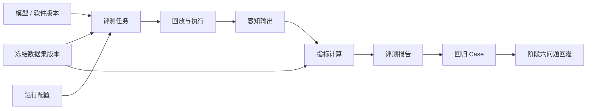

# 阶段五：自动化测试与评测

[English](README.md)

阶段五使用固定数据集、真值标签、回放传感器数据、结构化指标和可复现报告，对模型或感知软件版本进行评测。

它和阶段四模型训练的目的不同。训练会改变模型参数，自动化评测不改变模型，而是证明候选模型或软件版本是否足够好、哪里提升、哪里回退，以及哪些失败 case 应进入问题回灌。

## 目标

- 选择冻结后的数据集版本和模型/软件版本作为评测输入。
- 将 MCAP 或数据集派生样本回放到目标运行环境。
- 采集结构化感知输出。
- 将感知输出与冻结的统一标签进行对比。
- 生成指标、失败 case 和回归摘要。
- 为阶段六问题回灌提供候选问题。

## 范围

| 领域 | 阶段五能力 |
|---|---|
| 评测输入 | 冻结数据集 manifest、标签、模型版本、运行配置 |
| 数据回放 | 将 MCAP 或抽取样本喂给目标运行环境 |
| 运行执行 | 在容器、服务器或嵌入式运行环境中执行感知软件 |
| 输出采集 | 采集预测结果、日志和运行状态 |
| 指标计算 | 将预测结果与真值标签对比 |
| 报告生成 | 生成结构化报告和失败 case 列表 |

## 评测流程

## 关键文档

- [设计摘要](design-summary.zh-CN.md)
- [评测流程](evaluation-workflow.zh-CN.md)
- [回放与运行环境](replay-and-runtime.zh-CN.md)
- [指标与报告](metrics-and-report.zh-CN.md)
- [开发计划](development-plan.zh-CN.md)

## 公开示例

- [评测任务示例](../../examples/evaluation/evaluation-job.example.json)
- [感知输出示例](../../examples/evaluation/perception-output.example.json)
- [评测报告示例](../../examples/evaluation/evaluation-report.example.json)
- [回归 case 示例](../../examples/evaluation/regression-cases.example.json)
- [评测报告 demo](../../src-demo/evaluation-report-demo/README.zh-CN.md)

## 状态

规划中。

