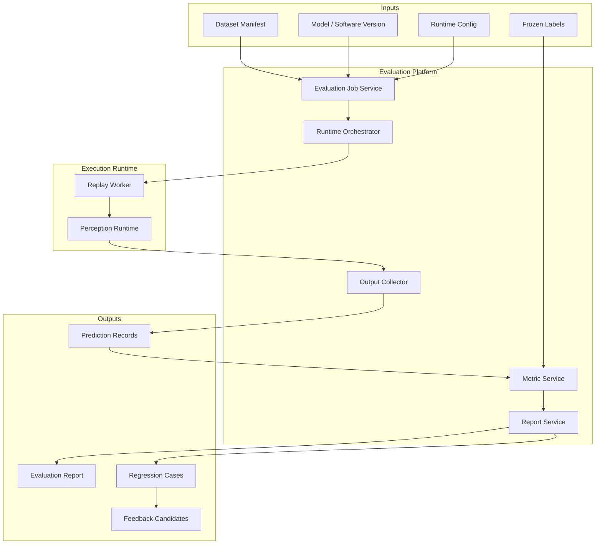

# Design Summary

[简体中文](design-summary.zh-CN.md)

## Design Intent

Phase 5 turns model versions from Phase 4 into measurable engineering decisions. It evaluates a fixed candidate against fixed data and frozen labels.

The key engineering principle is reproducibility. The same dataset version, label version, model version, runtime configuration, and metric configuration should produce the same report.

## Core Decisions

| ID | Decision | Rationale |
|---|---|---|
| D1 | Evaluation consumes frozen dataset versions | Prevents test input drift |
| D2 | Model/software versions are evaluated as immutable candidates | Keeps reports comparable |
| D3 | Replay and runtime are separated from platform orchestration | Avoids coupling UI workflows with heavy runtime execution |
| D4 | Metrics are generated from structured predictions and labels | Makes evaluation reproducible and inspectable |
| D5 | Failed cases become first-class outputs | Phase 6 feedback depends on explicit case records |
| D6 | Reports include lineage | Every metric must link back to data, labels, model, and runtime |

## Functional Architecture

## Main Entities

| Entity | Description |
|---|---|
| `evaluation_job` | One evaluation execution request |
| `runtime_config` | Replay, environment, topic, resource, and output settings |
| `prediction_record` | Structured model output for each frame or sample |
| `metric_record` | Overall, class, scenario, and regression metrics |
| `evaluation_report` | Human-readable and machine-readable report |
| `regression_case` | Failed or regressed sample for later analysis |

## Non-Goals

Phase 5 does not include:

- Training new models.
- Updating labels.
- Deploying models to production.
- Automatically changing probe rules, which belongs to Phase 6.

