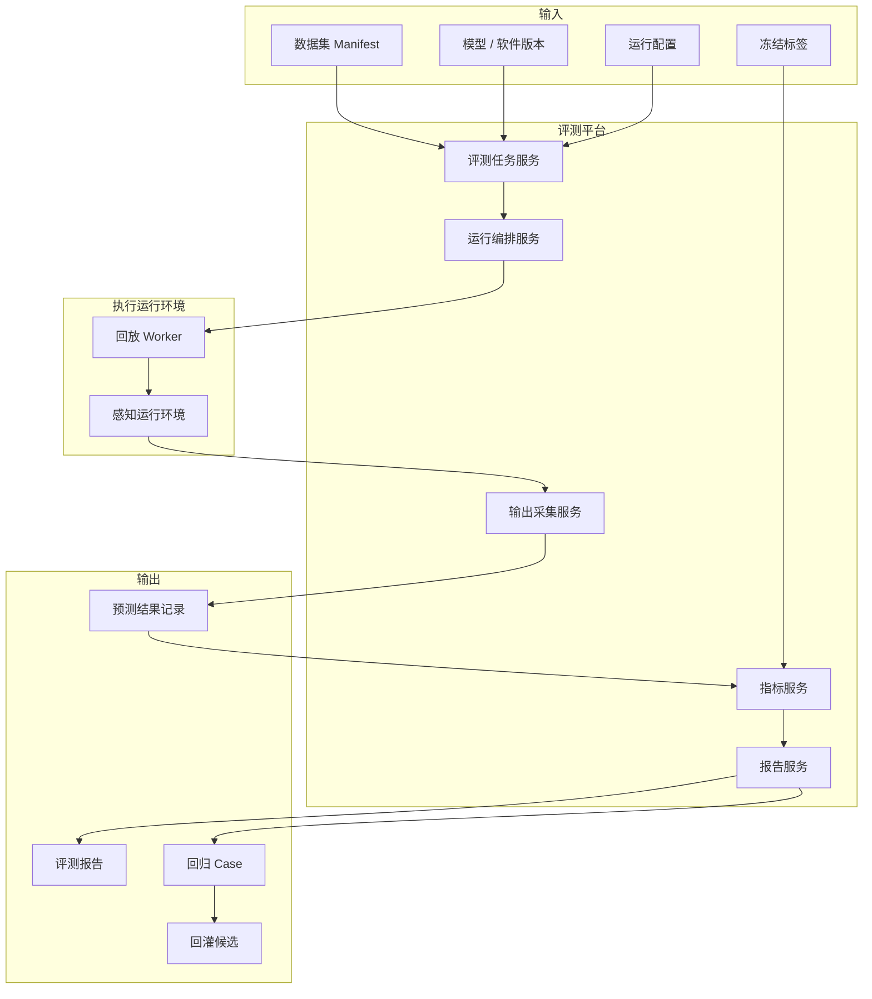

# 设计摘要

[English](design-summary.md)

## 设计意图

阶段五把阶段四产出的模型版本转化为可度量的工程决策。它用固定数据和冻结标签，对固定候选模型进行评测。

核心工程原则是可复现。同一个数据集版本、标签版本、模型版本、运行配置和指标配置，应当生成同一份评测报告。

## 核心设计结论

| 编号 | 设计结论 | 原因 |
|---|---|---|
| D1 | 评测消费冻结后的数据集版本 | 避免测试输入漂移 |
| D2 | 模型/软件版本作为不可变候选被评测 | 保证报告可比较 |
| D3 | 回放和运行环境与平台编排解耦 | 避免 UI 流程和重运行时强耦合 |
| D4 | 指标基于结构化预测和标签生成 | 保证评测可复现、可检查 |
| D5 | 失败 case 是一等输出 | 阶段六回灌依赖明确的问题记录 |
| D6 | 报告必须包含血缘关系 | 每个指标都应能追溯到数据、标签、模型和运行环境 |

## 功能架构

## 主要实体

| 实体 | 说明 |
|---|---|
| `evaluation_job` | 一次评测执行请求 |
| `runtime_config` | 回放、环境、topic、资源和输出配置 |
| `prediction_record` | 每帧或每个样本的结构化模型输出 |
| `metric_record` | 总体、类别、场景和回归指标 |
| `evaluation_report` | 人可读和机器可读的评测报告 |
| `regression_case` | 用于后续分析的失败或回退样本 |

## 非目标

阶段五不包含：

- 训练新模型。
- 修改标签。
- 将模型部署到生产。
- 自动修改探针规则，这属于阶段六。

