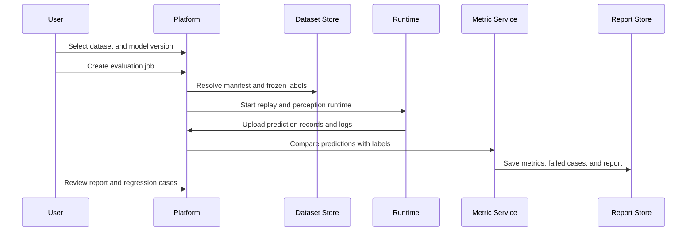
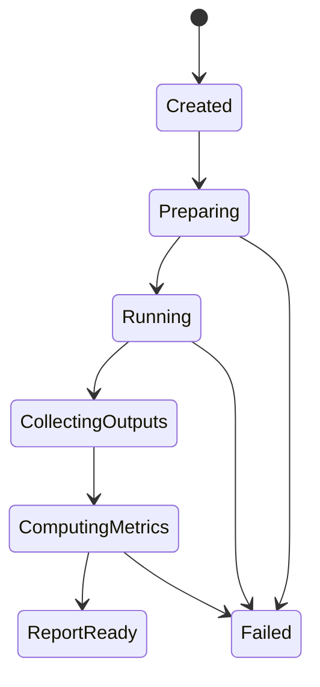

# Evaluation Workflow

[简体中文](evaluation-workflow.zh-CN.md)

## Main Workflow

## Evaluation Job States

## Required Inputs

- Dataset version.
- Frozen label version.
- Model or perception software version.
- Runtime configuration.
- Metric configuration.

## Required Outputs

- Prediction records.
- Runtime logs.
- Metric summary.
- Failed cases.
- Evaluation report.
- Feedback candidates.

