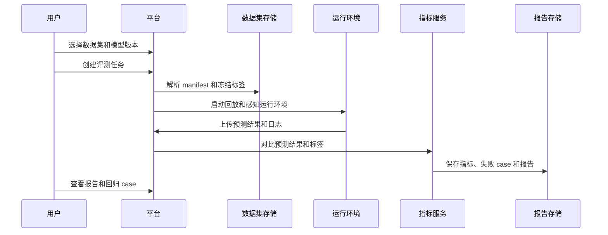
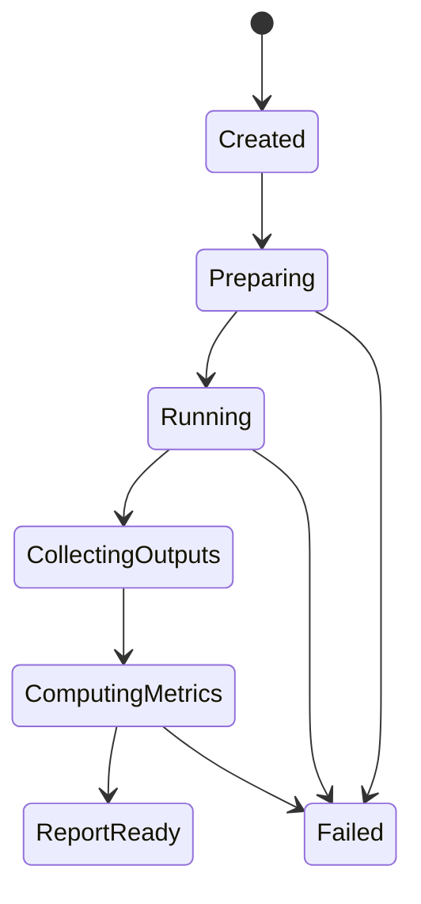

# 评测流程

[English](evaluation-workflow.md)

## 主流程

```mermaid
sequenceDiagram
  participant U as 用户
  participant P as 平台
  participant D as 数据集存储
  participant R as 运行环境
  participant M as 指标服务
  participant O as 报告存储

  U->>P: 选择数据集和模型版本
  U->>P: 创建评测任务
  P->>D: 解析 manifest 和冻结标签
  P->>R: 启动回放和感知运行环境
  R->>P: 上传预测结果和日志
  P->>M: 对比预测结果和标签
  M->>O: 保存指标、失败 case 和报告
  U->>P: 查看报告和回归 case
```

## 评测任务状态

```mermaid
stateDiagram-v2
  [*] --> Created
  Created --> Preparing
  Preparing --> Running
  Running --> CollectingOutputs
  CollectingOutputs --> ComputingMetrics
  ComputingMetrics --> ReportReady
  Running --> Failed
  Preparing --> Failed
  ComputingMetrics --> Failed
```

## 必要输入

- 数据集版本。
- 冻结标签版本。
- 模型或感知软件版本。
- 运行配置。
- 指标配置。

## 必要输出

- 预测结果记录。
- 运行日志。
- 指标摘要。
- 失败 case。
- 评测报告。
- 回灌候选。

