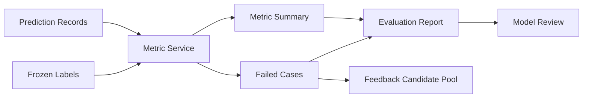

# Metrics and Report

[简体中文](metrics-and-report.zh-CN.md)

## Metric Types

| Type | Examples |
|---|---|
| Detection quality | precision, recall, F1, AP |
| Localization quality | center error, size error, heading error |
| Scenario metrics | daytime, night, intersection, dense traffic |
| Runtime metrics | latency, dropped frames, runtime errors |
| Regression metrics | improved, unchanged, regressed, new failure |

## Report Structure

An evaluation report should include:

- Job metadata.
- Dataset and label lineage.
- Model/software version.
- Runtime environment.
- Overall metrics.
- Class and scenario metrics.
- Failed cases.
- Regression summary.
- Recommended next step.

## Failed Case Record

Failed cases should be structured, not just screenshots. A case should include:

- Source sample ID.
- Source MCAP ID and timestamp.
- Expected label.
- Actual prediction.
- Error type.
- Scenario tags.
- Suggested feedback action.

## Report Flow

