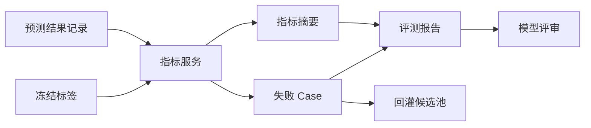

# 指标与报告

[English](metrics-and-report.md)

## 指标类型

| 类型 | 示例 |
|---|---|
| 检测质量 | precision、recall、F1、AP |
| 定位质量 | 中心点误差、尺寸误差、朝向误差 |
| 场景指标 | 白天、夜间、路口、密集交通 |
| 运行指标 | 延迟、丢帧、运行错误 |
| 回归指标 | 提升、持平、回退、新增失败 |

## 报告结构

评测报告应包含：

- 任务元信息。
- 数据集和标签血缘。
- 模型/软件版本。
- 运行环境。
- 总体指标。
- 类别和场景指标。
- 失败 case。
- 回归摘要。
- 推荐下一步动作。

## 失败 Case 记录

失败 case 应结构化记录，而不只是截图。一个 case 应包含：

- 来源样本 ID。
- 来源 MCAP ID 和时间戳。
- 期望标签。
- 实际预测。
- 错误类型。
- 场景标签。
- 建议回灌动作。

## 报告流程

