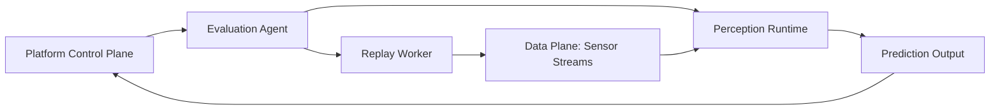

# Replay and Runtime

[简体中文](replay-and-runtime.zh-CN.md)

## Replay Role

Replay provides the same kind of input that the perception software expects during normal runtime. Depending on the system, replay can publish MCAP messages, extracted samples, or normalized sensor frames.

## Runtime Options

| Runtime | Use case |
|---|---|
| Local process | Quick algorithm validation and small demos |
| Container runtime | Reproducible server-side evaluation |
| Embedded target runtime | Hardware-specific perception validation |
| Simulation runtime | Future scenario-based evaluation |

## Control Plane and Data Plane

Control commands should manage jobs, versions, status, logs, and errors. Data streams should use the runtime's expected data interface.

## Runtime Isolation

Each evaluation should record:

- Runtime image or package version.
- Model or software version.
- Replay configuration.
- Hardware or node identity.
- Environment variables and key dependencies.
- Output location.

