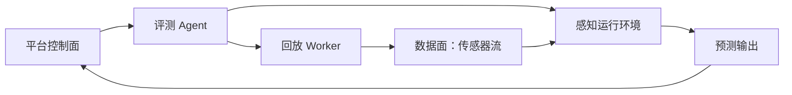

# 回放与运行环境

[English](replay-and-runtime.md)

## 回放的角色

回放负责提供感知软件在正常运行时预期接收的输入。根据系统不同，回放可以发布 MCAP 消息、抽取样本或标准化传感器帧。

## 运行环境选项

| 运行环境 | 使用场景 |
|---|---|
| 本地进程 | 快速算法验证和小型 demo |
| 容器运行环境 | 可复现的服务器侧评测 |
| 嵌入式目标环境 | 硬件相关的感知验证 |
| 仿真运行环境 | 后续基于场景的评测 |

## 控制面与数据面

控制命令应管理任务、版本、状态、日志和错误。数据流应使用运行环境预期的数据接口。

## 运行环境隔离

每次评测应记录：

- 运行镜像或软件包版本。
- 模型或软件版本。
- 回放配置。
- 硬件或节点标识。
- 环境变量和关键依赖。
- 输出位置。

