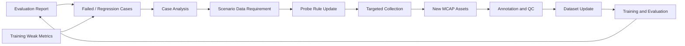

# Phase 6: Feedback-Driven Collection

[简体中文](README.zh-CN.md)

Phase 6 closes the autonomous data loop. It turns failed cases, weak scenarios, and regression findings from training and evaluation into new data requirements, updated probe rules, and targeted data collection plans.

The goal is to move from passive data accumulation to problem-driven data growth. Instead of collecting more data blindly, the system should collect the data that directly addresses model weaknesses.

## Goals

- Convert failed cases into structured feedback records.
- Cluster similar failures into scenario-level data requirements.
- Generate or update probe rules for targeted collection.
- Track whether new data improves later annotation, training, and evaluation results.
- Keep full lineage from issue discovery to recollected data and fixed model versions.

## Scope

| Area | Phase 6 capability |
|---|---|
| Feedback input | Failed cases, regression cases, weak metrics, and manual issue reports |
| Case analysis | Error type, class, scenario, timestamp, data source, and model lineage |
| Data requirement | Scenario-level collection demand with priority, target count, and deadline |
| Probe rule update | Convert requirements into vehicle-side or edge-side collection rules |
| Closed-loop tracking | Link new collected data to labels, datasets, training jobs, and evaluation results |
| Governance | Avoid duplicate, expired, or low-value collection tasks |

## Feedback Flow

## Key Documents

- [Design Summary](design-summary.md)
- [Feedback Workflow](feedback-workflow.md)
- [Case Analysis](case-analysis.md)
- [Probe Rule Generation](probe-rule-generation.md)
- [Metrics and Governance](metrics-and-governance.md)
- [Development Plan](development-plan.md)

## Public Examples

- [Feedback case example](../../examples/feedback/feedback-case.example.json)
- [Data requirement example](../../examples/feedback/data-requirement.example.json)
- [Probe rule update example](../../examples/feedback/probe-rule-update.example.json)
- [Feedback loop report example](../../examples/feedback/feedback-loop-report.example.json)
- [Probe rule builder demo](../../src-demo/feedback-rule-demo/README.md)

## Status

Planned.

