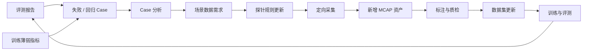

# 阶段六：问题回灌与主动采集

[English](README.md)

阶段六让自动驾驶数据闭环真正闭合。它将训练和评测中的失败 case、薄弱场景和回归问题，转化为新的数据需求、探针规则更新和定向采集计划。

目标是从被动堆数据转向问题驱动的数据增长。系统不应该盲目采更多数据，而应该采集真正能补齐模型短板的数据。

## 目标

- 将失败 case 转化为结构化回灌记录。
- 将相似失败聚合为场景级数据需求。
- 生成或更新用于定向采集的探针规则。
- 跟踪新增数据是否改善后续标注、训练和评测结果。
- 保留从问题发现到数据重采、模型修复的完整血缘关系。

## 范围

| 领域 | 阶段六能力 |
|---|---|
| 回灌输入 | 失败 case、回归 case、薄弱指标和人工问题记录 |
| Case 分析 | 错误类型、类别、场景、时间戳、数据来源和模型血缘 |
| 数据需求 | 场景级采集需求，包含优先级、目标数量和截止时间 |
| 探针规则更新 | 将需求转化为车端或边缘侧采集规则 |
| 闭环跟踪 | 将新采数据继续关联到标签、数据集、训练任务和评测结果 |
| 治理 | 避免重复、过期或低价值采集任务 |

## 回灌流程

## 关键文档

- [设计摘要](design-summary.zh-CN.md)
- [回灌流程](feedback-workflow.zh-CN.md)
- [Case 分析](case-analysis.zh-CN.md)
- [探针规则生成](probe-rule-generation.zh-CN.md)
- [指标与治理](metrics-and-governance.zh-CN.md)
- [开发计划](development-plan.zh-CN.md)

## 公开示例

- [回灌 case 示例](../../examples/feedback/feedback-case.example.json)
- [数据需求示例](../../examples/feedback/data-requirement.example.json)
- [探针规则更新示例](../../examples/feedback/probe-rule-update.example.json)
- [闭环报告示例](../../examples/feedback/feedback-loop-report.example.json)
- [探针规则生成 demo](../../src-demo/feedback-rule-demo/README.zh-CN.md)

## 状态

规划中。

