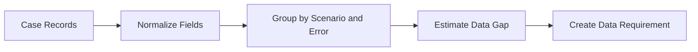

# Case Analysis

[简体中文](case-analysis.zh-CN.md)

## Case Record

A feedback case should be structured enough to support grouping and rule generation.

| Field | Purpose |
|---|---|
| `case_id` | Stable case identity |
| `source` | Training, evaluation, or manual report |
| `error_type` | False positive, false negative, localization error, class error, regression |
| `object_class` | Related object class |
| `scenario_tags` | Scene attributes such as night, intersection, dense traffic |
| `lineage` | Dataset, label, model, and evaluation job references |
| `suggested_action` | Data collection, label review, metric review, or model review |

## Grouping Dimensions

Recommended dimensions:

- Error type.
- Object class.
- Scenario tag.
- Distance range.
- Runtime version.
- Model version.
- Dataset version.

## From Case to Requirement

## Priority Strategy

Priority can be computed from:

- Safety or product impact.
- Failure frequency.
- Metric regression severity.
- Data scarcity.
- Collection feasibility.
- Deadline pressure.

