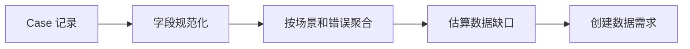

# Case 分析

[English](case-analysis.md)

## Case 记录

回灌 case 需要足够结构化，才能支持聚合和规则生成。

| 字段 | 作用 |
|---|---|
| `case_id` | 稳定 case 标识 |
| `source` | 训练、评测或人工报告 |
| `error_type` | 误检、漏检、定位误差、类别错误、回归 |
| `object_class` | 相关目标类别 |
| `scenario_tags` | 场景属性，例如夜间、路口、密集交通 |
| `lineage` | 数据集、标签、模型和评测任务引用 |
| `suggested_action` | 数据采集、标签复查、指标复查或模型复查 |

## 聚合维度

建议维度：

- 错误类型。
- 目标类别。
- 场景标签。
- 距离范围。
- 运行环境版本。
- 模型版本。
- 数据集版本。

## 从 Case 到需求

## 优先级策略

优先级可由以下因素计算：

- 安全或产品影响。
- 失败频次。
- 指标回退严重度。
- 数据稀缺程度。
- 采集可行性。
- 截止时间压力。

